# Diagrams and progress charts

Fifteen images for explaining the architecture and showing progress. They are
generated, not drawn by hand:

```
python scripts/make_diagrams.py            # all fifteen, ~17 s
python scripts/make_diagrams.py A3 P1      # just some
```

Each image is written to `docs/diagrams/` twice: **PNG** (for slides and the
report) and **SVG** (text stays editable in Inkscape, PowerPoint or Figma).
Every number on them is read from `outputs/review3_results.json`,
`outputs/varanasi_summary.json` and `outputs/varanasi_growth_model.json`, so
re-running after new results keeps every label true. A4 also reads the
night-light rasters and the typology raster.

Colour rules (same as `docs/figures/`): each architecture layer takes one hue
from a fixed, colour-blind-checked order (blue, orange, aqua, yellow, magenta);
green / amber / hatched mean done / in progress / planned and are always
written out next to the colour.

| # | File | One-line claim | Best used for |
|---|---|---|---|
| A1 | `A1_system_architecture` | Five layers, each a folder of the code | Opening slide of the method; "show us the architecture" |
| A2 | `A2_pipeline_dataflow` | Seven pipeline stages and what each hands to the next | Walking through `python -m urbanintel.pipeline` |
| A3 | `A3_ghost_typology_algorithm` | How one 100 m cell is classified | The core algorithm, the headline result |
| A4 | `A4_relative_light_trend` | Why the night-light trend is measured relative to the city | Answering "isn't all of Varanasi getting brighter?" |
| A5 | `A5_growth_model` | Train 2010–15, test 2015–20, project 2025 and 2030 | The prediction module |
| A6 | `A6_heat_island_method` | LST minus a rural reference from the same scene | The heat result and why it is negative |
| A7 | `A7_validation_framework` | Every claim, its independent evidence and the verdict | Technical Accuracy: "how do you know it is right?" |
| A8 | `A8_temporal_design` | Which years feed which step | Epoch discipline; no projection used as data |
| A9 | `A9_grid_and_aggregation` | 100 m analysis, 500 m reporting, four aggregation rules | Why ghost cells survive on the dashboard map |
| P1 | `P1_roadmap` | Phases, reviews and today | Progress overview, first or last slide |
| P2 | `P2_implementation_status` | Lines of code per module, implemented vs planned | Implementation criterion |
| P3 | `P3_corrections_before_after` | Eight numbers, Review 2 vs Review 3 | The corrections log in one picture |
| P4 | `P4_run_timeline` | `run_review3.bat` step by step, 3 min 20 s | Executable evidence; live demo |
| P5 | `P5_data_inventory` | 1.4 GB acquired, 779 MB essential | Data work done; the pendrive bundle |
| P6 | `P6_tests_and_defects` | Tests 20 → 25 → 41; the 15 defects by kind | Quality evidence |

Abbreviations used on the images: GHSL (Global Human Settlement Layer), VIIRS
(Visible Infrared Imaging Radiometer Suite), NDVI (Normalized Difference
Vegetation Index), NDBI (Normalized Difference Built-up Index), LST (Land
Surface Temperature), DW (Dynamic World), OSM (OpenStreetMap), POIs (points of
interest, e.g. shops, banks, schools), FoM (Figure of Merit), AUC (area under
the ROC curve), TOC (Total Operating Characteristic), EC (Economic Census),
DES (Directorate of Economics & Statistics, Govt of Uttar Pradesh).

---

## Architecture

### A1 — System architecture

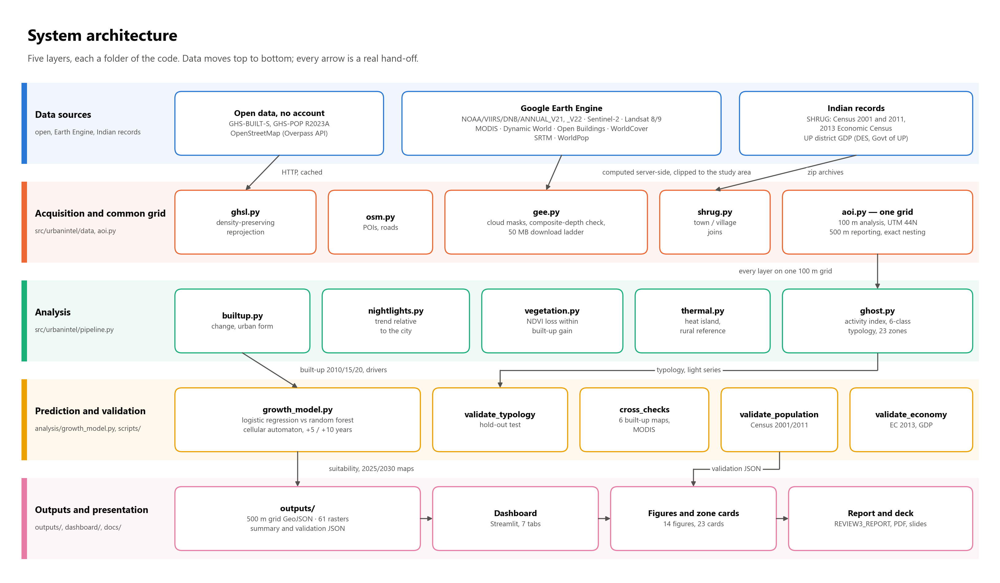

**What it shows.** Five horizontal layers: data sources → acquisition onto one
common grid → analysis → prediction and validation → outputs. Every box is a
real module; every arrow is a real hand-off, labelled with what moves.

**Talking points**
- Three kinds of source: open downloads with no account (GHS-BUILT-S and
  GHS-POP R2023A, OpenStreetMap), Google Earth Engine (`NOAA/VIIRS/DNB/ANNUAL_V21`
  and `ANNUAL_V22`, `COPERNICUS/S2_SR_HARMONIZED`, `LANDSAT/LC08/C02/T1_L2` and
  `LANDSAT/LC09/C02/T1_L2`, `MODIS/061/MOD11A2`, `GOOGLE/DYNAMICWORLD/V1`,
  Open Buildings, WorldCover, SRTM, WorldPop), and Indian records (SHRUG:
  Census 2001/2011 and the 2013 Economic Census; UP district GDP from DES).
- `aoi.py` is the join: every layer lands on the same 100 m grid (UTM zone 44N),
  and the 500 m reporting grid nests exactly, 25 cells to one.
- Earth Engine computes on Google's servers and sends back only the clipped
  study area, which is why the project runs on a laptop.

### A2 — Pipeline data flow

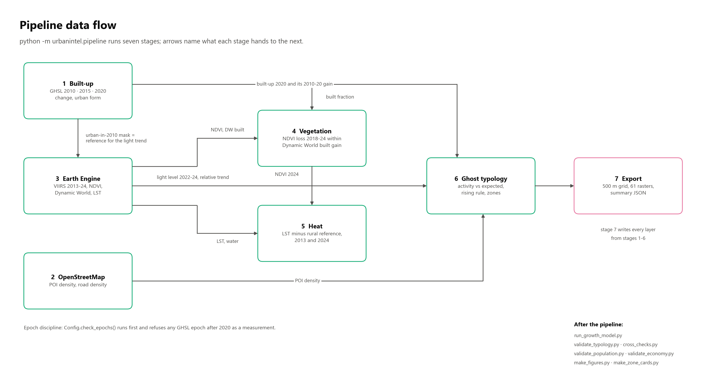

**What it shows.** The seven stages of `python -m urbanintel.pipeline` and the
exact layer each stage passes on.

**Talking points**
- Stage 1 (built-up) feeds almost everything: the 2020 built fraction for
  vegetation, the 2010–2020 gain for the typology, and the *urban-in-2010 mask*
  that defines "the established city" for the relative light trend.
- Stage 6 is where the three signals meet: night light, POI density and built-up.
- `Config.check_epochs()` runs before anything else and refuses a GHSL epoch
  after 2020 as a measurement: defect D1, fixed in code, not only in the documents.

### A3 — Ghost-growth typology algorithm

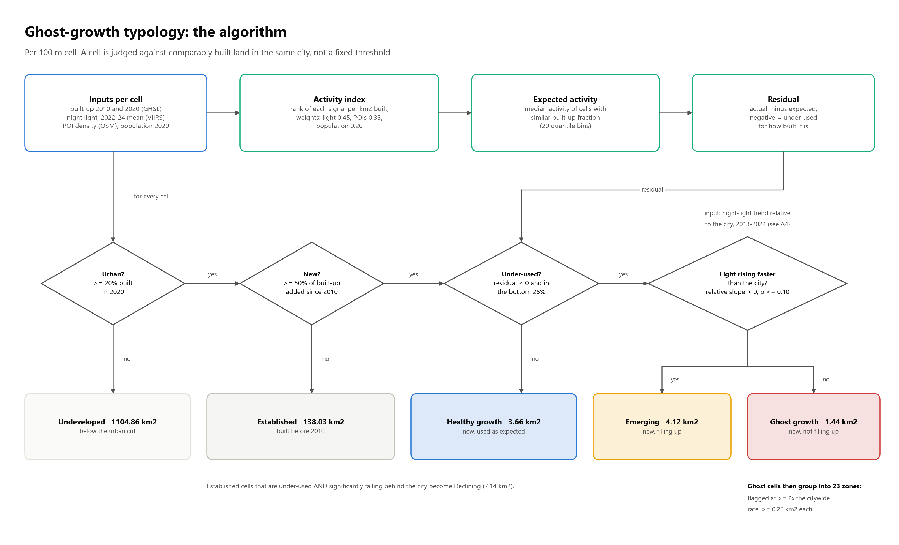

**What it shows.** The activity index, the expected activity for that
built-up level, the residual, and the four yes/no tests that sort a cell into
one of six classes.

**Talking points**
- The index ranks each signal *per km² built* (weights 0.45 light, 0.35 POIs,
  0.20 population), so a big built-up area is not "active" just because it is big.
- "Expected" is the median activity of cells with a similar built-up fraction
  (20 bins): each cell is judged against comparable land in the same city,
  not a fixed threshold.
- New and under-used cells split on the light trend: **emerging** if it rises
  significantly faster than the city (relative slope > 0, p ≤ 0.10), otherwise
  **ghost growth**. Result: 4.12 km² emerging, 1.44 km² ghost growth, 23 zones.
- This is a screening rule, not a ground truth: precision is unmeasured
  without field or image labels (planned for Review 4).

### A4 — Relative night-light trend

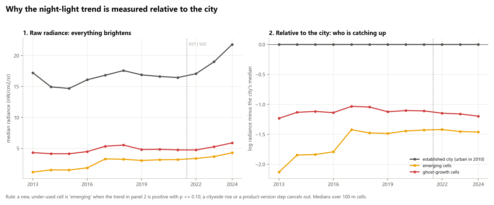

**What it shows.** Real medians from the rasters. Left: raw radiance, where
everything brightens, with a step at the 2021 → 2022 switch from `ANNUAL_V21`
to `ANNUAL_V22`. Right: the same cells relative to the established city.

**Talking points**
- On raw radiance, 51.4 % of urban cells show significant growth, so "rising"
  on the raw sign says little. Review 2 used that rule (defect D4).
- Subtracting the city's median cancels both the citywide rise and the
  product-version step; what remains is *catching up* or *falling behind*.
- The hold-out test (A7, first row) checks this rule on 2021–24 data it never saw.

### A5 — Growth-model architecture

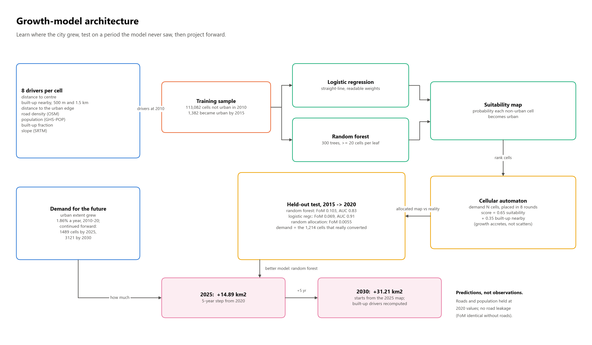

**What it shows.** Eight drivers → logistic regression and random forest →
suitability map → cellular automaton → held-out test → projections.

**Talking points**
- Logistic regression is a straight-line model with readable weights; random
  forest combines 300 decision trees and can capture non-linear effects.
  Both see the same drivers and the same split.
- Test period 2015 → 2020 was never used in training. Random forest wins on
  Figure of Merit (0.103 vs 0.069; random allocation 0.0055); logistic
  regression has the higher test AUC (0.91 vs 0.83). We pick on FoM because
  it scores the allocated map, which is what we publish.
- The cellular automaton mixes suitability (0.65) with built-up nearby (0.35),
  so new growth attaches to existing growth instead of scattering.
- 2025: +14.89 km², 2030: +31.21 km², both **predictions**. Dropping roads
  changes nothing (FoM 0.0687 both ways), so present-day OSM roads do not leak
  future information.

### A6 — Surface heat-island method

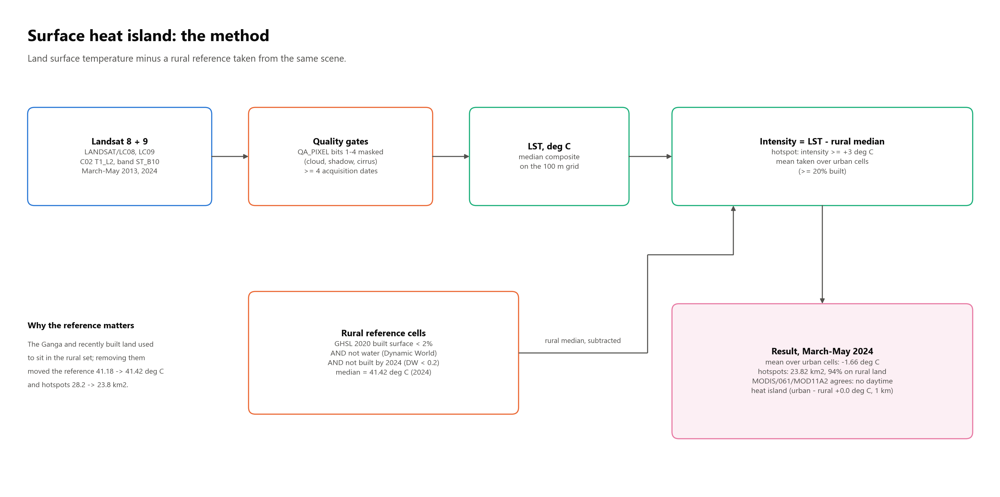

**What it shows.** Landsat 8 + 9 surface temperature (`ST_B10`), quality
gates, the rural reference, the intensity, and the result.

**Talking points**
- Quality gates: QA_PIXEL bits 1–4 masked (dilated cloud, cirrus, cloud,
  shadow); a composite needs at least four acquisition dates.
- The rural reference now excludes water and recently built land. That moved
  it from 41.18 to 41.42 °C and hotspots from 28.2 to 23.8 km².
- Result: urban cells are 1.66 °C *cooler* than rural land in March–May
  daytime, and 94 % of hotspots are bare pre-monsoon fields. MODIS agrees at
  1 km (urban − rural +0.01 °C). This is a known pattern for daytime surface
  temperature in dry seasons, not a bug.

### A7 — Validation framework

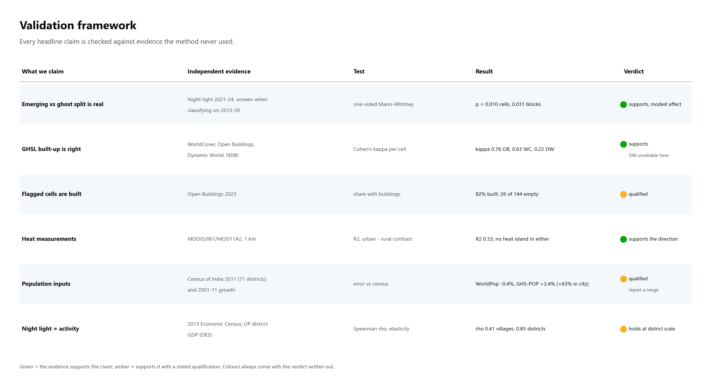

**What it shows.** Six headline claims, the independent evidence for each,
the test, the result, and a verdict (green = supports, amber = supports with
a stated qualification).

**Talking points**
- None of the evidence was used to build the result it checks.
- Hold-out: cells called *emerging* on 2013–20 brightened more in 2021–24
  than *ghost* cells (p = 0.010 cells, 0.031 at 500 m). Modest effect,
  honestly stated.
- GHSL agrees best with Open Buildings (κ 0.76) and WorldCover (0.63);
  Dynamic World over-labels built-up here (κ 0.22).
- Night light tracks economic activity at district scale (Spearman ρ 0.85 with
  district GDP) better than at village scale (ρ 0.41 with EC 2013 employment).
  So activity is reported as a **proxy**.

### A8 — Temporal design

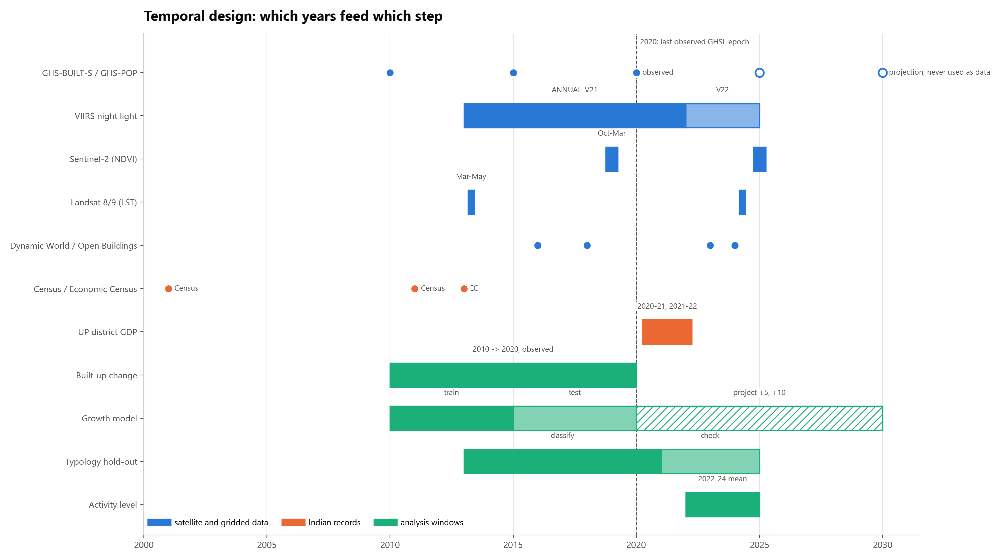

**What it shows.** For every dataset and every analysis step, the years it
covers. Hollow circles are GHSL projections; the dashed line is 2020, the last
observed GHSL epoch.

**Talking points**
- Built-up change is 2010 → 2020, observed only. 2025 and 2030 appear only as
  projections or as our own predictions.
- The model trains on 2010–15 and tests on 2015–20; the typology classifies on
  2013–20 and is checked on 2021–24. In both, the check uses data the method
  never saw.
- Activity uses the 2022–24 light mean, which gives land built by 2020 at
  least two years to be occupied.

### A9 — Analysis grid and aggregation

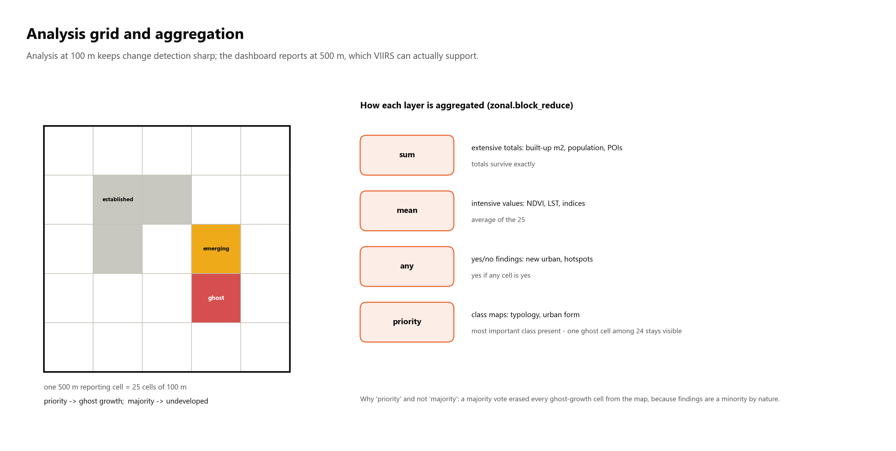

**What it shows.** One 500 m reporting cell = 25 analysis cells of 100 m,
and the four rules `zonal.block_reduce` uses to combine them.

**Talking points**
- 100 m keeps change detection sharp; 500 m matches what VIIRS (about 463 m)
  can actually resolve.
- Totals are summed, intensive values averaged, yes/no findings use "any",
  class maps use "priority".
- A majority vote erased every ghost-growth cell from the map, because a
  finding is a minority of its block by nature. Priority keeps it visible.

---

## Progress

### P1 — Roadmap and reviews

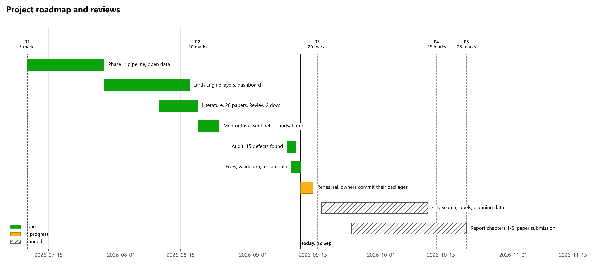

Phases from July to Review 5 with the review dates and their marks. Say where
we are (the black line) and that everything left of it is done and committed.
Review 4 work (city search, image labels, planning data) is hatched: planned,
not claimed.

### P2 — Implementation status

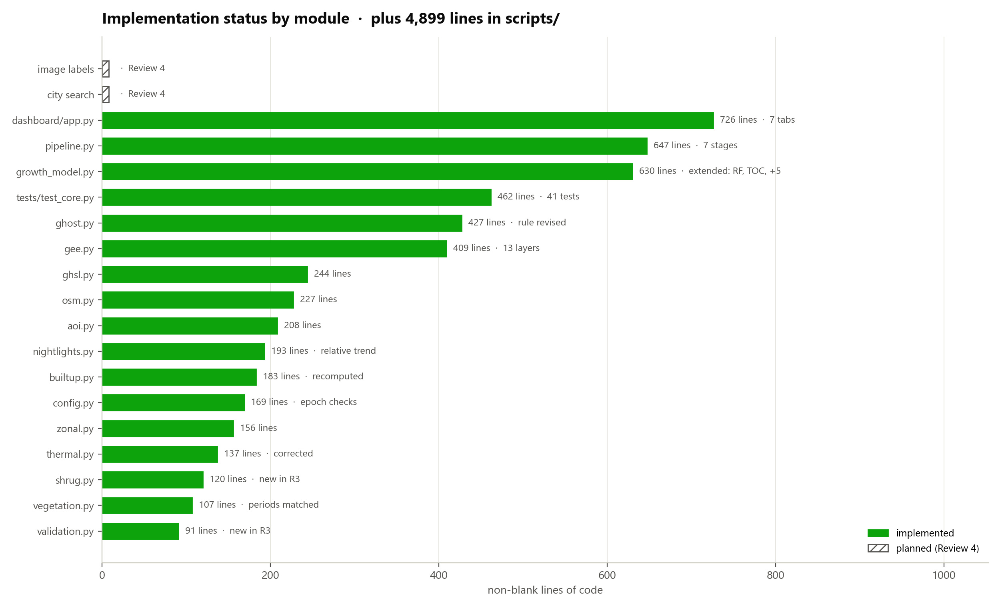

Non-blank lines per module, counted live from the repository, plus the total
in `scripts/`. Use it for the Implementation criterion: every box in A1 exists
as code. The two hatched rows are the Review 4 items.

### P3 — Corrections: Review 2 vs Review 3

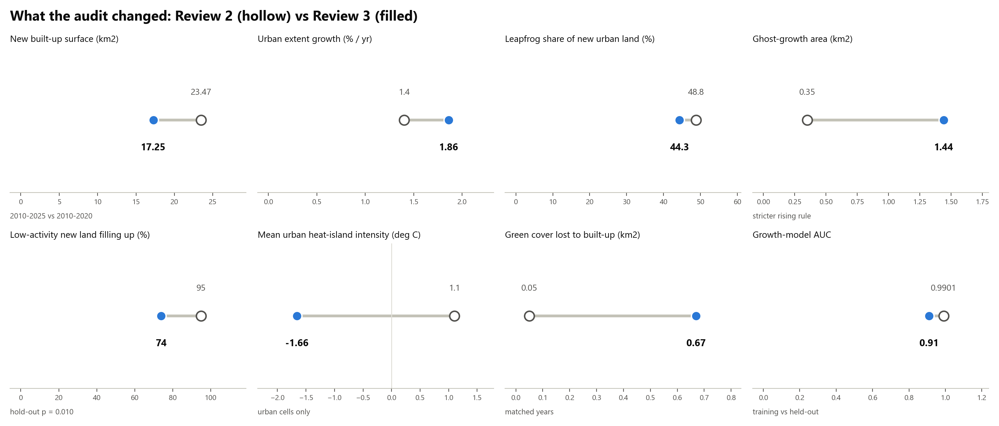

Eight numbers that changed after the audit; hollow = Review 2, filled =
Review 3. The biggest story is new built-up surface (23.47 → 17.25 km²),
because Review 2 counted GHSL's 2025 projection as data. Heat intensity
changed sign once the mean was taken over urban cells only and water left the
rural reference. The AUC fell because 0.99 was measured on training data;
0.91 is on the held-out period.

### P4 — One-command run

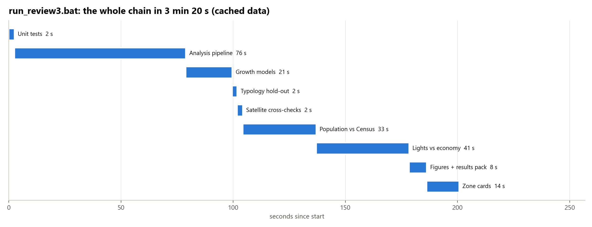

`run_review3.bat` from tests to zone cards in 3 min 20 s on cached data, the
executable evidence the rubric asks for. The two Earth Engine validations take
the longest because they compute on Google's servers.

### P5 — Data inventory

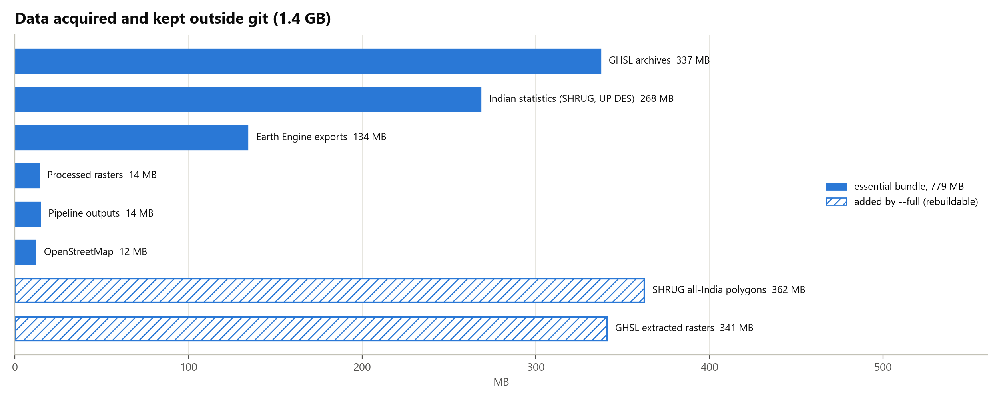

1.4 GB acquired and kept out of git; 779 MB is enough to rebuild every result
(`scripts/external_data.py export`). The hatched bars are rebuildable
(`--full` only).

### P6 — Tests and defects

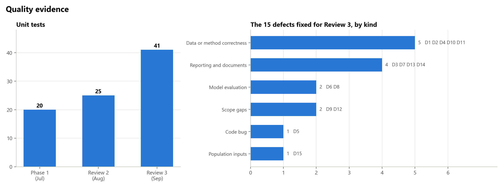

Unit tests grew from 20 to 41. The audit found 15 defects (D1–D15 in
`REVIEW3_REPORT.md`); all are fixed, and five were data or method
correctness issues, not cosmetic ones.

---

## Suggested order in a talk

1. P1 (where we are) → A1 (what we built) → A2 (how it runs)
2. A3 + A4 (the algorithm and the one idea that makes it robust)
3. A5 (prediction) → A6 (heat)
4. A7 + A8 (why the numbers can be trusted)
5. P3 (what we corrected) → P2 / P4 / P6 (evidence of implementation)
