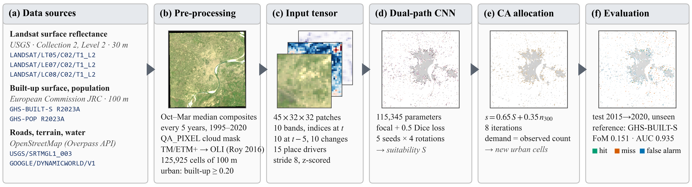
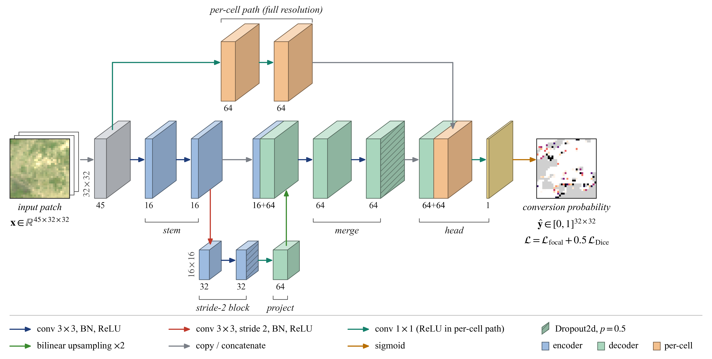
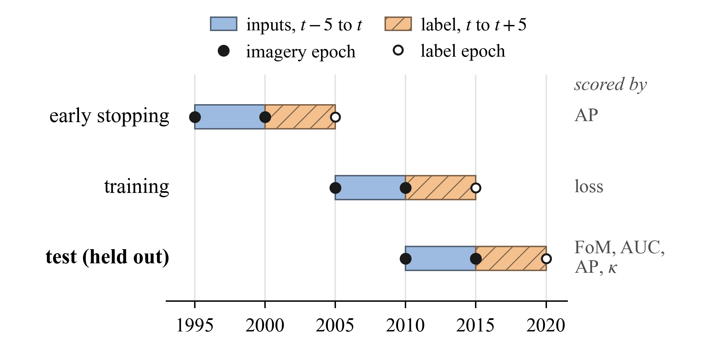
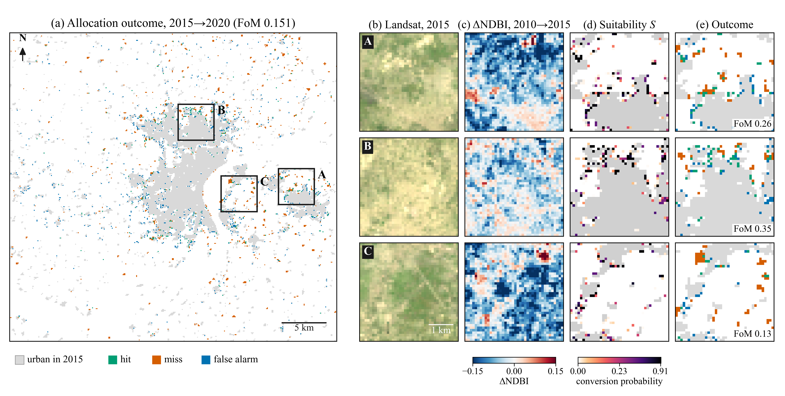

# Guide: Final Preview

A complete walk-through of the urban-growth prediction system for Varanasi, from the
raw satellite products to the final score. Written to be read start to finish by
someone who has not seen the code.

Everything here is reproducible with the commands in section 12. Every number comes
from a file in `outputs/`, and the environment that produced them is recorded in
section 13.



**Figure 1.** Overall framework. (a) Input data, by official identifier. (b) Dry-season
Landsat composites are cloud-masked, put on the OLI reflectance scale and resampled with
the built-up labels to the 100 m analysis grid (the 2015 composite is shown). (c) Each
training example is a 32 × 32-cell patch with 45 channels; three are shown for one
patch: true colour, NDBI change, and built-up growth over the previous five years.
(d) The network of Figure 2, averaged over five seeds and four rotations, gives a
suitability surface *S* (grey: already urban). (e) A cellular automaton places exactly
the observed number of new urban cells, ranking candidates by 0.65 *S* plus 0.35 times
the built-up share within 300 m (*n*₃₀₀), over eight iterations. (f) The placement is
compared with GHS-BUILT-S 2020 on the held-out 2015→2020 period.

All four figures are in `docs/figures/paper/` as PDF, SVG and 600 dpi PNG, at IEEE
column widths, and are drawn from the model's own outputs by
`python scripts/make_paper_figures.py`.

---

## 1. What the system predicts

The study area is a 35 x 33 km box around Varanasi, Uttar Pradesh, covering the
Municipal Corporation, the Ring Road corridor, the peri-urban belt and the airport
corridor to the north-west.

That area is divided into a grid of **125,925 square cells, each 100 x 100 metres**,
in UTM zone 44N (`EPSG:32644`). Every cell is either urban or not, by one rule:

> A cell is **urban** when at least **20 %** of its surface is built.

The question the model answers, for one five-year step:

> Given a cell that is **not** urban today, will it be urban in five years?

For the headline test the model is shown the city as it stood in **2015** and asked
about **2020**. In 2015 there were **111,700** cells that were not yet urban, and
**1,214** of them crossed the 20 % line by 2020. That is **one cell in ninety-two**,
and that rarity is the central difficulty: a model that predicts "nothing will
change" is right 98.9 % of the time and completely useless.

---

## 2. Where the data comes from

Official product identifiers, as published. Nothing here is renamed.

| Product | What it gives us | Years used |
|---|---|---|
| `GHS-BUILT-S R2023A` (tile R6_C26), Earth Engine mirror `JRC/GHSL/P2023A/GHS_BUILT_S` | Built-up surface in m² per 100 m cell. **The only label source.** | 1995, 2000, 2005, 2010, 2015, 2020 |
| `GHS-POP R2023A` | Residential population per cell | 1995–2020, five-yearly |
| `LANDSAT/LT05/C02/T1_L2` | Landsat 5 surface reflectance, 30 m | 1990, 1995, 2000, 2005, 2010 |
| `LANDSAT/LC08/C02/T1_L2` | Landsat 8 surface reflectance, 30 m | 2015 |
| `USGS/SRTMGL1_003` | Elevation, from which slope is computed | single epoch |
| `GOOGLE/DYNAMICWORLD/V1` | Water probability, used for distance to the Ganga | 2024 |
| OpenStreetMap via Overpass | Road centrelines and points of interest | present-day snapshot |

Two honest notes about provenance:

- **GHSL is itself a model product.** The labels are derived from satellite imagery by
  the Joint Research Centre's own classifier, not surveyed on the ground. Everything
  downstream inherits its errors. This is stated wherever a number is quoted.
- **OpenStreetMap is a present-day snapshot.** Roads and points of interest as they are
  now are used to describe the city as it was in 2010 or 2015. For roads this is the
  same assumption the published Review 3 model makes, and a with/without check is run.
  For points of interest it is worse, which is why they are excluded — section 7.

The epochs after 2020 that GHSL publishes (2025, 2030) are **projections by the GHSL
model**, not observations. They are never used as labels or for fitting. Doing so would
measure agreement between two models rather than accuracy against reality.

---

## 3. From raw products to the analysis grid

1. **Download.** Earth Engine exports are clipped to the study area and written as
   GeoTIFFs under `data/raw/gee/`. GHSL tiles come straight from the JRC open-data
   server into `data/raw/ghsl/`.
2. **Reproject.** Every layer is resampled onto the one shared 100 m grid
   (`gee.to_frame`), using average resampling for continuous layers and nearest for
   class masks.
3. **Derive.** Built-up surface in m² becomes a fraction by dividing by the cell area
   (10,000 m²). Distances, neighbourhood densities and the rest are computed from
   these rasters and cached in `data/processed/rasters/`.

Landsat composites deserve their own note, because they span a sensor change.

**Dry-season composites.** For each epoch, every clear Landsat scene between 1 October
of the previous year and 31 March is combined into a per-pixel median. October to
March is after the monsoon, when skies are clearest and the ground is not hidden by
flood water or peak vegetation. A median over a whole season removes clouds, haze and
the striping that affects individual scenes.

**Cloud masking.** Pixels flagged in the Collection 2 `QA_PIXEL` band as cloud,
cloud shadow, cirrus or dilated cloud are removed before compositing.

**Sensor harmonisation.** Landsat 5 (the Thematic Mapper) and Landsat 8 (the
Operational Land Imager) do not measure quite the same thing. Landsat 5 reflectance is
converted onto the Landsat 8 scale using the published Roy et al. (2016) ordinary
least-squares coefficients, band by band:

| Band | Slope | Intercept |
|---|---|---|
| Blue | 0.8474 | 0.0003 |
| Green | 0.8483 | 0.0088 |
| Red | 0.9047 | 0.0061 |
| Near infrared | 0.8462 | 0.0412 |
| Shortwave infrared 1 | 0.8937 | 0.0254 |
| Shortwave infrared 2 | 0.9071 | 0.0172 |

**Why that matters, and the check that it worked.** The model trains on Landsat 5 data
and is tested on Landsat 8 data. Without harmonisation the model would read the 2013
satellite change as a change on the ground. The check: median near-infrared reflectance
across the six epochs is **0.251 to 0.260**, with no step at the sensor change
(`docs/figures/dl/DL12_sensor_consistency.png`). Every epoch has **97.06 %** valid
pixels; the missing 3 % is the frame corner outside the clip.

Composites are stored as surface reflectance multiplied by 10,000 and saved as 16-bit
integers. This is the convention the Landsat and Harmonized Landsat and Sentinel-2
products use themselves, and it keeps each export under Earth Engine's 50 MB download
limit — the earlier 32-bit float version was 72 MB and was rejected.

---

## 4. The features: all 45 of them

Every feature is measurable **at or before** the date the prediction is made from.
Nothing describes the period being predicted.

### 4a. Imagery, 30 channels

Ten numbers describing the ground at the prediction date, the same ten from five years
earlier, and the change between them.

**Six reflectance bands** at each date: blue, green, red, near infrared, shortwave
infrared 1, shortwave infrared 2.

**Four indices** at each date, each a simple band ratio:

| Index | Formula | What it means |
|---|---|---|
| NDVI (Normalized Difference Vegetation Index) | (NIR − Red) / (NIR + Red) | how much living vegetation |
| NDBI (Normalized Difference Built-up Index) | (SWIR1 − NIR) / (SWIR1 + NIR) | how much built surface |
| NDWI (Normalized Difference Water Index) | (Green − NIR) / (Green + NIR) | open water |
| Brightness | mean of the six bands | overall reflectance |

The indices are handed over rather than learned. A network with a hundred thousand
parameters and about 1,400 positive examples should not have to rediscover a band
ratio that has been standard since the 1970s; the capacity is better spent on what it
cannot be told.

**Ten change channels**: each band and index at the prediction date minus its value
five years earlier. These matter more than either date alone. A cell where NDVI fell
and NDBI rose is a cell where vegetation became surface — that *is* development, seen
directly.

### 4b. Place features, 15 channels

What the satellite cannot see directly.

| Feature | Plain meaning | Why it predicts growth |
|---|---|---|
| `builtup_fraction` | how built-up the cell already is | partly built cells fill in |
| `neighbourhood_built_500m` | share of urban cells within 500 m | immediate adjacency |
| `neighbourhood_built_1500m` | the same within 1,500 m | neighbourhood effects |
| `neighbourhood_built_3000m` | the same within 3,000 m | district-scale agglomeration |
| `distance_to_urban_edge_km` | distance to the nearest urban cell | growth starts at the edge |
| `distance_centre_km` | distance to Kashi Vishwanath | the classic gradient |
| `road_density` | metres of road per cell, weighted by class (motorway 5.0 down to service 0.25) | access |
| `junction_density_500m` | **road junctions** within 500 m | connection, not just presence: a bypass raises road density without creating anywhere to turn off, while a grid of streets is where plots get built |
| `distance_to_major_road_km` | distance to a motorway, trunk or primary road | arterial-led growth |
| `distance_to_water_km` | distance to the Ganga | the river both attracts and blocks |
| `population_density` | residents per cell | demand |
| `slope_deg` | terrain steepness | near-flat here, so it does little |
| `builtup_growth_previous` | **built-up gained over the previous five years** | growth follows growth |
| `builtup_growth_previous_1500m` | the same, averaged over 1,500 m | a growing district keeps growing |
| `population_growth_previous` | population gained over the previous five years | demand that is already moving |

**The last three are called "momentum" and they are the strongest features in the
system.** A cell beside land that converted last period is a far better bet than one
beside land that has been static for twenty years, and none of the other features
carry that. By exact TreeSHAP attribution in the boosted model, `builtup_growth_previous`
is third strongest of all fifteen, behind only built-up fraction and population
density.

Momentum needs the built-up map from **ten** years before the prediction, not five, so
it only exists where that epoch is on disk. Getting the GHSL 2005 epoch downloaded is
what made it computable at all — see section 11.

### 4c. What is deliberately left out

- **Points of interest.** Section 7.
- **Night-time lights** (`NOAA/VIIRS/DNB/ANNUAL_V22`). The VIIRS record starts in 2013,
  so there is no value for 2010, and a feature that exists at one date and not another
  teaches the model the date rather than the place.
- **Anything dated after the prediction window.** NDVI from 2018 cannot be used to
  predict 2015 to 2020. That would be reading the answer.

---

## 5. The model

### 5a. Shape of the input

The network reads **square patches of 32 x 32 cells** — 3.2 x 3.2 km — with all 45
channels stacked. Patches rather than single cells, so the network can see spatial
pattern: a cell on a growing edge looks different from an isolated one even when their
own numbers match.

Each channel is standardised to mean 0 and standard deviation 1, using statistics from
the **training date only**, so no information from the test period reaches the model
through the normalisation.

### 5b. Architecture



**Figure 2.** The dual-path network (115,345 parameters). Each block is a feature map:
its height and depth show the grid size (32 × 32 or 16 × 16 cells) and its width the
number of channels, given beneath it; hatching marks dropout. The context path (encoder
and decoder) bases each output on a 17 × 17-cell window (1.7 km) but rebuilds the map
from a 16 × 16 grid, so its output is smooth. The per-cell path applies two 1 × 1
convolutions to each cell's 45 values alone and keeps full resolution. The two are
concatenated and a 1 × 1 convolution gives one logit per cell. The input (true colour
shown) and the output are a real patch from the 2015→2020 test period; grey cells were
already urban.

<details>
<summary>Every layer, with its shape and parameter count (taken from the model itself)</summary>

Shapes are (channels, height, width); the batch dimension is left out. Every 3×3
convolution uses padding 1 and no bias, because batch normalisation follows it.

| Block | Layer | Input → output | Parameters |
|---|---|---|---:|
| Encoder stem | Conv2d 3×3, 45 → 16 | (45,32,32) → (16,32,32) | 6,480 |
| | BatchNorm2d + ReLU | (16,32,32) | 32 |
| | Conv2d 3×3, 16 → 16 | (16,32,32) → (16,32,32) | 2,304 |
| | BatchNorm2d + ReLU | (16,32,32) | 32 |
| Encoder stage 2 | Conv2d 3×3, 16 → 32, stride 2 | (16,32,32) → (32,16,16) | 4,608 |
| | BatchNorm2d + ReLU | (32,16,16) | 64 |
| | Conv2d 3×3, 32 → 32 | (32,16,16) → (32,16,16) | 9,216 |
| | BatchNorm2d + ReLU + Dropout2d(0.5) | (32,16,16) | 64 |
| Decoder project | Conv2d 1×1, 32 → 64 | (32,16,16) → (64,16,16) | 2,112 |
| | bilinear upsample ×2 | (64,16,16) → (64,32,32) | 0 |
| | concatenate the stem output | (64+16,32,32) = (80,32,32) | 0 |
| Decoder merge | Conv2d 3×3, 80 → 64 | (80,32,32) → (64,32,32) | 46,080 |
| | BatchNorm2d + ReLU | (64,32,32) | 128 |
| | Conv2d 3×3, 64 → 64 | (64,32,32) → (64,32,32) | 36,864 |
| | BatchNorm2d + ReLU + Dropout2d(0.5) | (64,32,32) | 128 |
| Per-cell path | Conv2d 1×1, 45 → 64 + ReLU | (45,32,32) → (64,32,32) | 2,944 |
| | Conv2d 1×1, 64 → 64 + ReLU | (64,32,32) → (64,32,32) | 4,160 |
| Head | concatenate both paths | (64+64,32,32) = (128,32,32) | 0 |
| | Conv2d 1×1, 128 → 1 | (128,32,32) → (1,32,32) | 129 |
| | sigmoid | (1,32,32), a probability per cell | 0 |
| **Total** | | | **115,345** |

</details>


Two paths that meet at the output. Total **115,345 parameters** — deliberately small.

**The context path** (an encoder and decoder, the usual convolutional arrangement):

| Stage | Operation | Output |
|---|---|---|
| Stem | two 3×3 convolutions, batch normalisation, ReLU | 16 channels, 32×32 |
| Stage 2 | the same with stride 2, dropout 0.5 | 32 channels, 16×16 |
| Decoder | 1×1 projection, then upsample and merge the stem | 64 channels, 32×32 |

Shrinking the grid lets each later unit see a wider area; expanding it returns to one
value per cell. Measured from the network's own gradients, each output of the context
path depends on a **17 × 17-cell window (1.7 km)** around its cell.

**The per-cell path**: two 1×1 convolutions straight from the 45 input channels to 64
channels, at full resolution. A 1×1 convolution looks at one cell and nothing else, so
this path is mathematically a small neural network applied to each cell on its own.

The two are concatenated and a final 1×1 convolution produces **one number per cell**,
turned into a probability by the logistic (sigmoid) function.

**Why the second path exists, and it is the single most important design decision
here.** Every earlier version had a high AUC and a poor Figure of Merit: it ranked the
whole map well and the top of the map badly. That is the signature of a surface that is
too smooth. The context path can only produce smooth output, because it rebuilds
everything from a grid that has been shrunk and re-expanded, blurring each prediction
across roughly twenty cells. But the Figure of Merit is decided entirely by the top
~1,200 cells, where blur is fatal. The per-cell path can be arbitrarily sharp. Adding
it moved the Figure of Merit from **0.0813 to 0.1166** for seven thousand extra
parameters.

### 5c. Training

**Three separate time periods, and they never mix.**



**Figure 3.** Three five-year transitions. Inputs are imagery at *t* − 5 and *t*, the
change between them, and place features at *t*; the label is whether a cell that is not
urban at *t* is urban at *t* + 5. The label windows never overlap. Weights are fitted on
2010→2015, the stopping epoch is chosen by average precision on 2000→2005, and
2015→2020 is scored once at the end.

| Period | Role |
|---|---|
| **2010 → 2015** | training: the model learns which cells converted |
| **2000 → 2005** | early stopping: a different period decides when to stop |
| **2015 → 2020** | test: touched once, at the very end |

The stopping period is a different *period*, not a different *place*. This matters.
Earlier versions stopped on held-out blocks inside the training period — different
places, same years — and a 1000-epoch run then chose a model that scored **better** on
those blocks and **24 % worse** on the real test. A network of this size keeps
improving on the training years by learning what those particular years looked like,
and none of that transfers. Spatial separation does not protect against overfitting in
time.

**The loss.** Two terms, computed only over cells that were not already urban:

- **Focal cross-entropy** (α = 0.25, γ = 2). Ordinary cross-entropy would be swamped by
  the 99 % of easy negatives; the focal term fades out cells the model already gets
  right, so the gradient keeps coming from the built-up edge where the decision is hard.
- **Soft Dice**, weighted 0.5. Cross-entropy scores cells one at a time; Dice scores the
  predicted *set* against the observed set, which is closer to what the Figure of Merit
  actually measures.

**Sampling and augmentation.** Each batch of 8 patches is drawn with patches containing
at least one conversion weighted 4× — otherwise most batches would be empty
countryside. Each patch is randomly rotated or reflected into one of its eight
symmetries. This is legitimate here because a map has no natural "up" for this task:
growth on the northern edge looks like growth on the southern edge. It would not be
legitimate for a task that depends on orientation, such as reading shadows.

**Optimiser.** AdamW, learning rate 1e-3 with cosine decay, weight decay 1e-4,
gradients clipped at norm 5.0, dropout 0.5. Twenty batches per epoch, up to 250 epochs,
stopping after 40 epochs without improvement. A short epoch is deliberate: with a long
one the model shoots past its best point inside a single epoch and early stopping never
sees it.

### 5d. Predicting

1. The patch window slides across the map at half-patch steps; where windows overlap
   the **logits are averaged before** the sigmoid, so there are no seams.
2. **Test-time augmentation**: the map is predicted four times, once in each rotation,
   each prediction rotated back and averaged.
3. **Five models** trained with different random seeds are averaged. Single runs vary
   by about ±0.006 and averaging is the honest way to handle that rather than reporting
   the luckiest.

The result is one **suitability surface**: a number from 0 to 1 for every cell.

---

## 6. From suitability to a predicted map

A suitability score is a ranking, not a map. Two more steps.

**Demand — how many cells convert.** For the test, demand is the number that really
converted: **1,214**. Fixing it this way isolates the question being asked — *given that
1,214 cells converted, did you put them in the right places?* — from the separate
question of how much growth there will be. For a genuine forecast, demand comes from the
compound annual growth rate of urban extent (1.86 % per year for 2010–2020), giving
+1,489 cells by 2025 and +3,121 by 2030.

**Allocation — a cellular automaton.** Rather than taking the top 1,214 cells in one
shot, growth is placed over eight rounds. In each round every candidate is scored as

```
score = 0.65 × suitability + 0.35 × (share of urban cells within 300 m)
```

the best are converted, and the next round recomputes the neighbourhood term with those
conversions included. Earlier growth therefore influences later growth, which is what
produces connected development instead of scattered dots.

**An honest finding about that 0.35.** It has been fixed by hand since Review 2 and was
never tested. Sweeping it shows every model scores at least as well with a *lower*
weight, and the boosted model scores much better with none at all (0.1262 against
0.0864). This fits something the project already measured: Varanasi's growth is heavily
leapfrog, so insisting on contiguity pulls predictions toward the existing edge when
much of the new development appeared away from it.

The recommendation is **not** to set it to zero. The neighbourhood term is what makes a
predicted map look like a city rather than a scatter of cells, and the 2025 and 2030
projections would change character without it. Report the sweep and let the reader see
the trade-off. Figures: `docs/figures/dl/DL11_neighbourhood_weight.png`.

---

## 7. Why points of interest are not used

Worth documenting because it was tested thoroughly and the answer was no.

A fresh OpenStreetMap fetch keeping tags gave **2,001 places across 113 distinct
kinds**, and sixteen features were built from them: footfall-weighted density at two
scales (each place weighted by a documented **proxy** for daily visitors — a shopping
mall 20, a railway station 20, a hospital 12, a school 8, a kiosk 2); gravity
accessibility discounted by 1/(1 + d²) out to 3 km; one density per kind of activity;
mix entropy over those kinds; variety; and distance to the nearest of each kind.

| Feature set | Features | Figure of Merit | Hits |
|---|---|---|---|
| No points of interest | 15 | 0.1573 | 299 |
| One aggregate count | 16 | 0.1589 | 304 |
| All sixteen above | 31 | 0.1584 | 303 |

The spread is 0.0016, which is noise. The sixteen features together are **3.9 %** of the
model's total contribution; the strongest, distance to the nearest retail, scores 0.074
against built-up fraction's 3.02.

**The reason is structural, not a modelling failure.** This model only ever ranks cells
that are **not yet urban**, and points of interest are dense where the city already is.
At the growth frontier every density layer is flat zero — which is exactly why the only
POI features that register at all are the *distance* ones, since a distance still varies
out there and a count does not. Whatever they encode is already carried by population
density and built-up fraction, because shops follow people. The Varanasi snapshot also
has a tourism signature rather than a growth one: 292 hospitals, 117 hotels, 91 hostels,
66 guest houses.

They are excluded on principle as well as on score: a shop appears **after** the
development it would be used to predict, which is the worst leakage risk of any layer.

---

## 8. How the result is scored

All metrics are computed over eligible cells only — cells that were not already urban
in 2015 — because crediting a model for leaving the existing city alone would inflate
every score toward 1.

**The confusion of change:**

| | Really converted | Really did not |
|---|---|---|
| **Predicted converted** | hit | false alarm |
| **Predicted did not** | miss | correct rejection |

**Figure of Merit** — the project's headline metric:

```
FoM = hits / (hits + misses + false alarms)
```

Correct rejections are excluded, which is the point: with 98.9 % of cells not changing,
any metric that counts them is dominated by the easy cases. A perfect model scores 1.0.
Published urban-growth models typically land between 0.10 and 0.30.

**The others, and what each adds:**

- **Producer's accuracy** = hits / (hits + misses): of the cells that converted, how many
  were found.
- **User's accuracy** = hits / (hits + false alarms): of the cells predicted, how many
  were right.
- **Cohen's kappa**: agreement corrected for what chance alone would give.
- **AUC**: the chance that a randomly chosen converted cell is ranked above a randomly
  chosen unconverted one. Threshold-free, but dominated by easy negatives.
- **Average precision**: precision averaged over the ranking. Unlike AUC it is computed
  against the positive class alone, so it stays honest at a 1 % base rate. **Note:** it
  is *not* invariant to class balance, so it must never be computed on a subsampled set
  — doing so inflated some intermediate numbers earlier in this project.
- **TOC (Total Operating Characteristic) curve**: for every cut-off, how many cells are
  flagged against how many really converted. Keeps the counts a ROC curve throws away.
- **Ratio to random**: the same demand placed uniformly at random, averaged over 20
  draws, gives a Figure of Merit of **0.0055**. Every result is quoted as a multiple of
  that, because otherwise a reader cannot tell skill from base rate.

---

## 9. Results

Held-out 2015 → 2020, scored once, 1,214 conversions among 111,700 eligible cells.



**Figure 4.** Results on the held-out 2015→2020 period. (a) Allocation outcome of the
five-model ensemble over the study area: a hit is a conversion that was predicted and
observed, a miss was observed but not predicted, a false alarm was predicted but not
observed; Figure of Merit = hits / (hits + misses + false alarms). (b)–(e) The three
4 × 4 km windows with the most observed conversions, chosen by the reference data and
not by how well the model did: the 2015 Landsat composite, the NDBI change the model
was given, its suitability *S* (square-root colour scale; grey: already urban), and the
outcome with each window's own Figure of Merit.

| Model | AUC | Avg. precision | **Figure of Merit** | Kappa | Hits | × random |
|---|---|---|---|---|---|---|
| **Deep model: imagery + drivers** | **0.9351** | **0.1930** | **0.1507** | **0.254** | **318** | **27.4** |
| Gradient-boosted trees, 15 drivers | 0.9418 | 0.2026 | 0.1404 | 0.238 | 299 | 25.5 |
| Random forest, 15 drivers | 0.9504 | 0.1977 | 0.1340 | 0.228 | 287 | 24.3 |
| Random forest, 8 drivers (Review 3) | 0.8331 | 0.1270 | 0.1016 | 0.176 | 224 | 18.4 |
| Logistic regression, 8 drivers | 0.9096 | 0.1092 | 0.0687 | 0.119 | 156 | 12.5 |
| Deep model, imagery only | — | — | 0.0452 | — | — | 8.2 |
| Random allocation | 0.500 | — | 0.0055 | — | 13 | 1.0 |

**Stability.** The five seeds behind the deep model score 0.1496, 0.1458, 0.1523, 0.1469
and 0.1340 — a mean of **0.1457 with a standard deviation of 0.0063**, the tightest of
any configuration tried. The ensemble of the five scores 0.1507.

**Reading the table.** The deep model is best, and it is best *because of the imagery*:
the fifteen driver features on their own are exactly what the boosted trees already
had, and the imagery alone scores 0.0452. Neither half would have got there.

**Where the gains came from**, in order of size:

| Change | Figure of Merit |
|---|---|
| Review 3 random forest, 8 drivers | 0.1016 |
| + growth momentum and the other new features (tabular) | 0.1404 |
| Deep model before the per-cell path | 0.0813 |
| + per-cell path from input to head | 0.1166 |
| + growth momentum restored to the deep model | **0.1457** (ensemble 0.1507) |

---

## 10. The rest of the system

**Uncertainty.** Twenty draws of the model, one allocation each, give a probability per
cell rather than a yes or no: 1,167 cells are chosen in every draw, 44 in most, 54 only
sometimes. The confident core is far larger than the uncertain fringe, which is what a
planner needs to know.

**Ghost growth** — built-up land that is not being used. The published rule flags cells
with a high share of new built-up and low activity (night-time lights, points of
interest, population). An autoencoder trained only on built-up cells with normal
activity independently flags the 5 % it reconstructs worst (772 cells) and picks out 34
of the rule's 144. Neither has ground truth, so this is corroboration, not accuracy.

**The outstanding gap.** The ghost-growth flag still has **no measured precision**. The
fix is 150–300 hand-labelled cells checked against high-resolution historical imagery by
two people independently, with agreement measured by Cohen's kappa. That remains the
single most valuable piece of work left in the project.

---

## 11. Problems found along the way

Each of these would have produced a confident wrong number, and each is worth being able
to describe.

1. **The deep model was training on twelve driver features while the documentation
   claimed fifteen.** A feature has to exist at the training date, the stopping date and
   the test date; growth momentum at 1995 needs a 1990 built-up epoch that was never
   downloaded, so all three momentum features were silently dropped. Found while writing
   the plain-English explanation of the pipeline. Stopping on 2000–2005 instead keeps
   them, and that alone moved the Figure of Merit from 0.1166 to 0.1457.
2. **Validation could vanish silently.** At 30 m the area divides into nine 16 km blocks,
   but the edge blocks are slivers. The random split picked two slivers, no validation
   tile fitted inside either, and the run proceeded with no validation data at all. Block
   selection now refuses blocks too small to hold a tile.
3. **One block size for two different models.** The system handed the image model's 16 km
   blocks to the boosted trees as well. Early stopping on two such blocks is far too
   coarse: XGBoost stopped after **2 rounds** and scored 0.0557 instead of 0.0864. The
   tabular models now get their own finer split.
4. **The blend was nearly fitted on cells the image model had trained on.** Its split is
   now reproduced on the model's own grid and projected down, rather than recomputed at
   100 m and assumed to match.
5. **Average precision was being computed on a subsampled negative set**, which inflated
   validation figures — AP, unlike AUC, depends on the class balance.
6. **Earth Engine refuses downloads over 50 MB**; the six-band 32-bit export was 72 MB.
   Writing scaled integers fixed it and matches how the products are published anyway.
7. **The JRC server drops its 40 MB tiles part-way through** and the shared downloader
   restarted from zero every time, so the GHSL 2005 epoch never arrived. Adding
   byte-range resume is what eventually made growth momentum — the strongest feature in
   the system — computable at all.
8. **The console reported training on transitions it had held out.** The line printed
   before the split was decided. The recorded output files were always correct.
9. **Training to convergence made the result worse.** A 1000-epoch run chose a model that
   scored better on the validation blocks and 24 % worse on the test period. That is what
   led to stopping on a different period instead.

---

## 12. Reproducing all of it

```bash
# 1. Satellite imagery: six-band dry-season composites, harmonised across sensors
python scripts/export_landsat_stack.py --years 1990 1995 2000 2005 2010 2015 --ghsl

# 2. The published pipeline: rasters, urban form, activity, ghost typology
python -m urbanintel.pipeline

# 3. The Review 3 growth models, for the baseline row
python scripts/run_growth_model.py

# 4. The deep model: five seeds, about 1.5 minutes each on a laptop CPU
for s in 0 1 2 3 4; do
  python scripts/train_image_v2.py --factor 1 --with-drivers --stop-on 2000 \
    --epochs 250 --patience 40 --steps 20 --widths 16 32 --dropout 0.5 \
    --seed $s --tag v5_s$s
done

# 5. Every model scored side by side, plus the uncertainty and ghost checks
python scripts/run_deep_system.py --components 16

# 6. Twelve analytics figures
python scripts/make_dl_figures.py

# 7. Tests
python tests/test_core.py      # 41
python tests/test_deep.py      # 16
```

Useful switches: `--no-drivers` for imagery alone, `--factor 5` to work at 20 m and pool
to cells, `--encoder prithvi` for the pretrained satellite transformer, `--no-tta` to
predict once, `--pixel-loss` to score the loss per pixel as the first version did.

**Where things live**

```
src/urbanintel/deep/        the Review 4 model code
  features.py               the 15 place features, junctions, momentum
  stacks.py                 channel stacks, normalisation, labels
  tiles.py                  spatial blocks, tiling, pixel-to-cell lookup
  nets.py                   encoder, decoder, per-cell path, losses
  train.py                  training loop, checkpointing, prediction
  boost.py                  gradient boosting and the blend
  analytics.py              every metric in section 8
  ensemble.py, anomaly.py, embed.py, prithvi.py
scripts/train_image_v2.py   the deep model
scripts/run_deep_system.py  one command, every model, one results file
outputs/                    every number quoted here
docs/figures/dl/            twelve figures
docs/DEEP_MODELS.md         the running record, with each result dated
```

---

## 13. What to be careful claiming

**The test period has been used more than once.** 2015–2020 has been scored once per
configuration tried across this work. It remains a fair measure of any single
pre-specified design, and it is **not** a clean hold-out for having *chosen* among
designs. The feature set was specified before it was scored and the architecture fix
came from diagnosing a failure mode rather than from a search, but the final figure
still benefits from the test period having been seen. A genuinely clean re-test becomes
possible when GHSL publishes an **observed** 2025 epoch.

**The labels are a model's output.** GHS-BUILT-S is produced by a classifier, not
surveyed. "Accuracy" here means agreement with GHSL.

**Roads are a present-day snapshot** used to describe the past. The with/without check
is reported.

**Nothing here measures whether a flagged ghost-growth zone is really empty.** That
needs the hand labels.

**Reproducibility across library versions is not exact.** Re-running the unmodified
Review 3 script today gives the random forest a Figure of Merit of 0.1016 where the
recorded run gives 0.1031 — same code, same data, a different scikit-learn. Logistic
regression reproduces exactly. Quote forest numbers with the version beside them.

Environment for every number in this guide: Python 3.13.3, numpy 2.3.3,
scikit-learn 1.6.1, xgboost 3.0.5, torch 2.10.0+cpu, no GPU.
