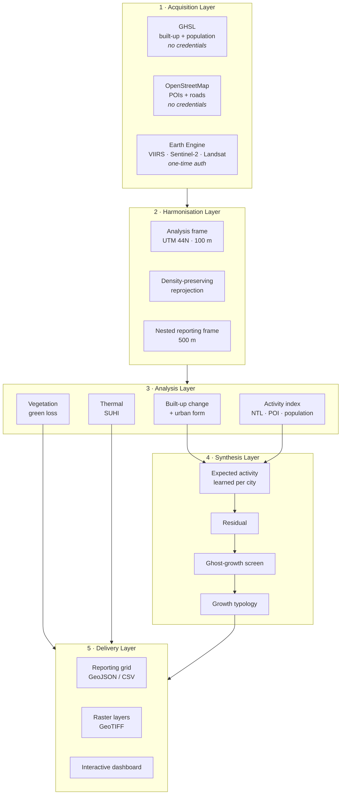
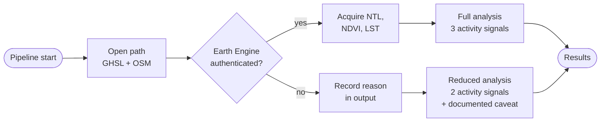
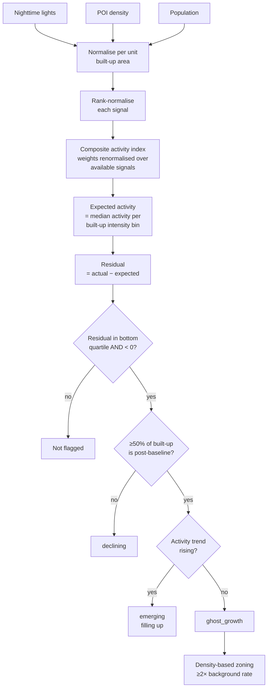
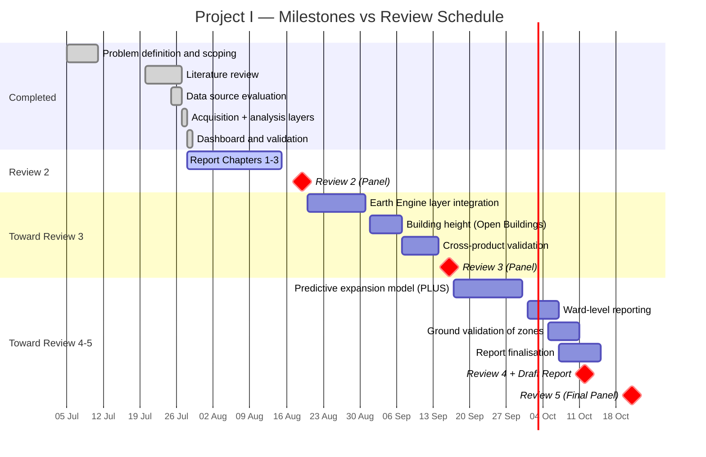

# Satellite-Based Urban Growth and Economic Activity Intelligence System

### A Case Study of Varanasi, Uttar Pradesh

**BCSE497J — Project I · Fall Semester 2026–2027**
**School of Computer Science and Engineering (SCOPE)**

**Review 2 Submission — Chapters 1–3**
Review date: 19 August 2026

---

> **Fill before submission:** Student name(s) and registration number(s), guide
> name and designation, bonafide certificate, declaration, acknowledgement.
> These are institutional pages that must carry real signatures and are
> deliberately left as placeholders here.

| | |
|---|---|
| **Student(s)** | *[Name, Reg. No.]* |
| **Guide** | *[Name, Designation]* |
| **School** | School of Computer Science and Engineering |
| **Programme** | *[B.Tech CSE]* |
| **Submitted** | August 2026 |

---

## Abstract

Indian cities are expanding faster than the administrative systems that
measure them. Ground-based instruments for tracking urban change — municipal
building-permit records, decennial census, property-tax rolls — are slow,
spatially coarse, and systematically incomplete at the peri-urban fringe where
most growth actually occurs. This creates a measurement gap precisely where
planning decisions are most consequential.

This project develops a satellite-based intelligence system that measures
urban expansion and economic activity from open Earth-observation data, and
combines them to answer a question neither can answer alone: **which parts of
a city have been built but are not being used?**

The system integrates multi-epoch built-up surface data (GHSL), nighttime
light radiance (VIIRS), optical land cover (Sentinel-2, Dynamic World),
thermal infrared (Landsat), and ground-level activity evidence
(OpenStreetMap). It classifies new development by urban form — infill, edge
expansion, or leapfrog — and screens for *ghost growth*: recently developed
land whose activity falls significantly below the level that comparably
developed land in the same city achieves. Rather than applying a fixed
threshold, the expected activity for a given built-up intensity is learned
empirically from the city's own data, making the method self-calibrating and
transferable between cities.

Applied to Varanasi over a 1,206 km² area of interest, the system finds that
built-up surface grew from 72.48 km² to 95.95 km² between 2010 and 2025
(+32.4%) while population grew 13.9% — land consumption outpacing population
growth by a factor of 2.3. Of newly urbanised land, 48.8% is leapfrog
development detached from the existing urban fabric. With the full VIIRS annual
series 2013–2024 integrated, the ghost-growth screen identifies 0.35 km² across
15 spatially coherent zones, all peripheral — independently consistent with the
leapfrog finding — and separates a further 6.88 km² as *emerging*, development
that is dim but measurably brightening.

Results are delivered through an interactive dashboard providing map layers,
growth trends, and prioritised planning insights.

**Keywords:** urban growth monitoring, nighttime lights, remote sensing,
urban heat island, ghost cities, Google Earth Engine, Varanasi

---

## Table of Contents

1. [Introduction](#chapter-1--introduction)
   1.1 Background and Motivation · 1.2 Problem Statement · 1.3 Objectives ·
   1.4 Scope · 1.5 Expected Outcomes · 1.6 Organisation of the Report
2. [Literature Review](#chapter-2--literature-review)
   2.1 Nighttime Lights as an Economic Proxy · 2.2 Built-up and Impervious
   Surface Mapping · 2.3 Urban Form Classification · 2.4 Green Cover and
   Surface Urban Heat Island · 2.5 Ghost-City and Underutilisation Detection ·
   2.6 Predictive Urban Growth Modelling · 2.7 Comparison of Existing
   Approaches · 2.8 Identified Research Gaps
3. [Methodology and System Design](#chapter-3--methodology-and-system-design)
   3.1 Methodological Overview · 3.2 System Architecture · 3.3 Module Design ·
   3.4 Data Sources · 3.5 Core Algorithms · 3.6 Experimental and Validation
   Design · 3.7 Tools and Technologies
4. [Feasibility, Risks, Ethics and Work Plan](#chapter-4--feasibility-risks-ethics-and-work-plan)
5. [References](#references)
6. [Appendices](#appendices)

**List of Figures**

| No. | Figure |
|---|---|
| 3.1 | System architecture — four-layer pipeline |
| 3.2 | Data acquisition dual-path design |
| 3.3 | Ghost-growth detection workflow |
| 3.4 | Growth typology decision logic |
| 4.1 | Project timeline against review schedule |

**List of Tables**

| No. | Table |
|---|---|
| 2.1 | Comparison of existing approaches |
| 2.2 | Research gaps and how this work addresses them |
| 3.1 | Module responsibilities |
| 3.2 | Data sources and access requirements |
| 3.3 | Analytical thresholds and justification |
| 3.4 | Validation strategy per module |
| 4.1 | Risk register |
| 4.2 | Milestone plan |

**List of Abbreviations**

| | |
|---|---|
| AOI | Area of Interest |
| CVD | Colour Vision Deficiency |
| DMSP-OLS | Defense Meteorological Satellite Program – Operational Linescan System |
| GEE | Google Earth Engine |
| GHSL | Global Human Settlement Layer |
| LST | Land Surface Temperature |
| NDBI | Normalised Difference Built-up Index |
| NDVI | Normalised Difference Vegetation Index |
| NTL | Nighttime Lights |
| OSM | OpenStreetMap |
| POI | Point of Interest |
| SUHI | Surface Urban Heat Island |
| UTM | Universal Transverse Mercator |
| VIIRS | Visible Infrared Imaging Radiometer Suite |

---

# Chapter 1 — Introduction

## 1.1 Background and Motivation

More than half the world's population now lives in cities, and the United
Nations projects that India alone will add over 400 million urban residents by
2050. This growth is not evenly distributed: it concentrates in mid-sized
cities that have neither the administrative capacity nor the data
infrastructure of metropolitan centres.

Varanasi is a representative case. It is one of the world's oldest
continuously inhabited cities, a major religious and tourism destination, and
the subject of substantial recent infrastructure investment — a new airport
terminal, ring road corridors, and riverfront redevelopment. It is also
governed with instruments that were not designed for rapid change: the last
full census was 2011, building-permit records are not spatially referenced,
and there is no routine mechanism for detecting where construction has
occurred without approval.

Satellite remote sensing offers a way around this. Earth observation is
frequent, spatially explicit, consistent across administrative boundaries, and
— increasingly — free. What has historically limited its use in planning is
not data availability but *interpretation*: a satellite can show that a
building exists, but not whether anyone is in it.

The central motivation of this project is that combining two independent
satellite signals — physical development and human activity — yields
information neither provides alone. A region that is built but dark, and
built but empty of the amenities that accompany occupation, is measurably
different from one that is both built and busy. Detecting that divergence is
the core contribution of this work.

## 1.2 Problem Statement

> Existing urban monitoring in Indian cities cannot reliably answer three
> questions that materially affect planning decisions: **where** is the city
> expanding, **what kind** of expansion is it, and **is the new development
> actually being used?**

Four specific deficiencies follow from this.

**(a) Detection latency.** Built-up change is typically discovered through
census or survey cycles measured in years. Development that outpaces the
measurement cycle is invisible until it is already established.

**(b) Absence of form classification.** Aggregate statistics such as "the city
grew by X km²" conflate infill development — which uses existing water,
sewerage and transport capacity — with detached leapfrog development, which
requires new networks at far higher per-household cost. These have opposite
fiscal implications and are not distinguished in current practice.

**(c) No occupancy signal.** Physical construction is measurable; utilisation
is not. Large developments can be completed and remain substantially
unoccupied, and there is no routine mechanism to detect this. Committed
infrastructure investment continues to serve them regardless.

**(d) Environmental externalities are tracked separately, if at all.** Green
cover loss and urban heat island intensification are consequences of the same
expansion process, but are typically monitored — when monitored — by different
agencies on different cycles, preventing any joint analysis.

## 1.3 Objectives

| # | Objective | Measurable outcome |
|---|---|---|
| **O1** | Build a reproducible pipeline acquiring multi-source open satellite and geospatial data for any city from a single configuration file | Pipeline runs end-to-end for Varanasi; a new city requires only a new config file |
| **O2** | Quantify built-up expansion across multiple epochs and classify it by urban form | Per-epoch built-up area; infill / edge / leapfrog shares with area attribution |
| **O3** | Derive a composite economic-activity surface from nighttime lights, commercial POI density and population, normalised per unit of development | Activity index defined for all sufficiently developed cells, with per-cell signal provenance |
| **O4** | Detect and delineate ghost-growth zones using an empirically-learned expectation rather than a fixed threshold | Ranked list of contiguous zones with area, location and confidence measures |
| **O5** | Quantify green cover loss attributable to urbanisation, and map surface urban heat island intensity and population-weighted heat vulnerability | Green loss separated from agricultural variation; SUHI intensity and hotspot area |
| **O6** | Deliver findings through an interactive dashboard usable by a non-technical planner | Multi-layer web dashboard with maps, trends, and prioritised zone list |
| **O7** | Validate correctness through automated testing and documented methodology | Unit-test suite over analytical logic; complete methodology documentation |

## 1.4 Scope

**In scope**

- Single-city analysis, demonstrated on Varanasi (1,206 km² AOI), with a
  city-agnostic configuration system.
- Analysis period 2010–2025 for built-up and population; 2013–2024 for
  nighttime lights; 2015–2025 for optical land cover.
- Analysis at 100 m resolution; reporting at 500 m.
- Open and free data sources only — no commercial imagery.
- Detection, characterisation and visualisation.

**Out of scope**

- Building-level occupancy determination. The spatial resolution of the
  activity signals does not support claims about individual structures.
- Real-time or near-real-time alerting. The system operates on annual epochs.
- Causal attribution. The system identifies *where* under-utilisation occurs,
  not *why*.
- Commercial very-high-resolution imagery (sub-metre), which would change the
  cost and licensing basis of the project.
- Formal planning approval or enforcement use without ground verification.

**Deliberate boundary.** The system is designed and described as a
**screening tool**. Its output identifies locations warranting inspection. It
is not an occupancy census and its findings are not evidence of vacancy on
their own. This boundary is stated in the software, the documentation and the
dashboard, not only in this report.

## 1.5 Expected Outcomes

1. A reproducible, configuration-driven analysis pipeline.
2. A quantified account of Varanasi's expansion 2010–2025 with urban form
   attribution.
3. A ranked inventory of candidate ghost-growth zones with spatial extents.
4. Environmental impact layers — green cover loss and heat vulnerability.
5. An interactive planning dashboard.
6. Documented, tested, and openly-licensed source code.

## 1.6 Organisation of the Report

**Chapter 2** reviews the literature across six relevant strands, compares
existing approaches, and identifies the gaps this work addresses.
**Chapter 3** presents the proposed methodology, system architecture, module
design, data sources, and core algorithms. **Chapter 4** covers feasibility,
risk, ethical considerations, and the work plan. Implementation details,
results and analysis will form Chapter 5, and conclusions Chapter 6, in
subsequent reviews.

---

# Chapter 2 — Literature Review

## 2.1 Nighttime Lights as an Economic Proxy

The use of satellite-observed nighttime radiance as a proxy for economic
activity was established by Henderson, Storeygard and Weil [1], who
demonstrated a robust relationship between light growth and GDP growth,
particularly valuable where national accounts are weak. Their central caution
is equally important: the elasticity of light to output is well below unity
and varies by sector and development level. Light is a proxy, not a
measurement.

Sensor characteristics constrain what is possible. DMSP-OLS (1992–2013)
provides the longest record but suffers 6-bit saturation in bright cores,
blooming, and no on-board calibration. VIIRS (2012–present) improves radiometric
range, sensitivity and calibration substantially. Elvidge et al. [2] produced
the standard annual VIIRS composite (VNL V2) with outlier removal and
background nulling, which is the series used in this work. Román et al. [3]
developed the NASA Black Marble suite (VNP46A), applying BRDF, atmospheric and
lunar corrections — important for month-to-month change detection, where
uncorrected products confound activity change with lunar phase.

A substantial literature addresses harmonising DMSP with VIIRS to obtain long
series. Chen et al. [4] apply a U-Net super-resolution network to produce a
global 500 m annual simulated-VIIRS product 1992–2023; Tian et al. [5] use a
two-stage deep model guided by impervious-surface data for China 1986–2024.
These are technically strong but solve a problem this project does not have:
its analysis window begins in 2010 and its built-up baseline is 2010, so the
harmonisation error term would be incurred to purchase history that is not
used.

Applied studies confirm the utility of VIIRS for urban work. Anucharn et al.
[6] compared Google Earth Engine processing against traditional unsupervised
classification for Chiang Mai, reporting overall accuracy of 0.80–0.82 for GEE
and a strong correlation (R² ≈ 0.97) between nighttime light intensity and
electricity consumption. That correlation is at *provincial aggregate* level;
it should not be read as evidence for per-pixel economic inference, a
distinction not always observed in the applied literature.

### 2.1.1 Comparative analysis of cross-sensor calibration implementations

The harmonisation literature was examined in depth as a comparative set of five
implementations — Zheng et al. (2019), Li et al. (2020), Zhao et al. (2020),
Chen et al. (2021) and Nechaev et al. (2021) — selected on a stated criterion:
each must perform DMSP↔VIIRS calibration, release a continuous annual product,
and validate by regression against real VIIRS. The full comparison, and the
parallel set of U-Net-based implementations, is in
[`LITERATURE_NTL_AND_UNET.md`](LITERATURE_NTL_AND_UNET.md).

Three conclusions from that analysis bear directly on the methodology adopted
in Chapter 3. First, reported accuracy rises monotonically with spatial
aggregation and varies far less with model family: Chen et al. (2024) report
R² of 0.617 at pixel level rising to 0.964 at national level, and describe
their own U-Net's accuracy as close to that of an auto-encoder. Second, the
enabling ingredient in the two implementations that succeed at the hard
direction (DMSP→VIIRS) is auxiliary daytime data — a vegetation index — rather
than the architecture. Third, and most consequentially here, the residual error
of simulated NTL products is spatially structured and concentrates at the urban
fringe: Chen et al. document their own product underestimating fringe radiance
because neighbouring dark pixels pull bright ones down, and the competing
ChenVNL product underestimating peri-urban areas while overestimating cores.

Since every ghost-growth zone identified in this project is peripheral, the
fringe is precisely where a simulated product is least trustworthy. This
independently reinforces the decision stated above to restrict the analysis to
observed VIIRS (VNL V2, 2012 onward) rather than adopting a harmonised
long-series product, and to report findings at neighbourhood rather than pixel
scale.

## 2.2 Built-up and Impervious Surface Mapping

Goldblatt et al. [7] demonstrated an influential approach: using nighttime
lights as weak supervision to train a Landsat-based built-up classifier in
Google Earth Engine, producing 30 m maps for India, Mexico and the United
States without extensive ground-reference data. This addresses the principal
obstacle to supervised classification at scale — label scarcity — and its
validation on India makes it directly relevant here.

Tang et al. [8] combined an EVI-adjusted nighttime light index with MODIS data
and a GA-BP neural network to estimate impervious surface percentage in the
Guangdong–Hong Kong–Macao Greater Bay Area, reporting R² = 0.92. The approach
is sound but operates at approximately 1 km, too coarse for intra-city zone
delineation.

Several global products now supersede bespoke classification for many
purposes. Gong et al. [9] produced GAIA, annual 30 m global impervious area
1985–2018 with over 90% overall accuracy. Marconcini et al. [10] produced the
World Settlement Footprint. The European Commission's GHSL programme provides
GHS-BUILT-S, multi-temporal built-up *surface* density at 100 m for 1975–2030
in five-year epochs. Brown et al. [11] introduced Dynamic World, near-real-time
10 m land cover from Sentinel-2 with per-pixel class probabilities.

## 2.3 Urban Form Classification

Aggregate growth statistics obscure planning-relevant distinctions. The
landscape expansion index family of methods, developed by Liu et al. [12],
classifies new development by its spatial relationship to existing
development — infill, edge expansion, or outlying (leapfrog) — using the
proportion of already-developed land in a neighbourhood around each new patch.

This distinction carries direct fiscal consequence. Leapfrog development
requires extension of water, sewerage, power and transport networks at
substantially higher per-household cost than infill. It is also the form most
associated in the literature with under-occupancy, which makes it a natural
prior for ghost-growth analysis.

## 2.4 Green Cover and Surface Urban Heat Island

Zhou et al. [13] provide the standard review of satellite SUHI analysis. Their
central methodological point concerns the reference: SUHI intensity is
meaningful only relative to a defined rural baseline, and the choice of that
baseline drives the result. Water bodies in particular must be excluded, since
their thermal behaviour differs fundamentally from rural land and their
inclusion biases the baseline cold.

Ermida et al. [14] published open Google Earth Engine code for Landsat land
surface temperature retrieval using a statistical mono-window algorithm with
NDVI-based emissivity, spanning Landsat 4 through 8. This is the practical
reference implementation for LST work and is adopted here in simplified form.

For green cover, NDVI thresholding remains standard, but studies in
agricultural regions face a confound that is often unaddressed: in
intensively cropped landscapes such as the Indo-Gangetic plain, year-on-year
NDVI variation is dominated by the cropping calendar rather than by
urbanisation. Attributing NDVI decline to urban growth without controlling for
this systematically overstates green loss.

## 2.5 Ghost-City and Underutilisation Detection

This is the strand most directly relevant to the project's distinguishing
contribution.

Jin et al. [15] identified "ghost cities" in China's Yangtze River Delta by
combining multiple remote sensing datasets, establishing the multi-source
principle: no single signal is sufficient, because each has a characteristic
failure mode. Low nighttime lights alone flags unlit agricultural land; low
population alone flags industrial estates and commercial districts.

Lu et al. [16] combined nighttime satellite data with daytime imagery to map
China's ghost cities, operationalising the built-but-dark test. Their
contribution is the explicit pairing of a development signal with an activity
signal, rather than thresholding either alone.

More recent global work extends this to an "urban vitality" formulation,
combining nighttime lights, land surface temperature, points of interest and
population density into a composite, and testing new development against it.

The methodological trajectory across this literature is from **absolute
thresholds** toward **relative mismatch** — comparing observed activity
against what would be expected given the level of development. This project
adopts and extends that direction.

## 2.6 Predictive Urban Growth Modelling

Cellular automata approaches dominate urban expansion simulation. Liang et al.
[17] introduced the PLUS model, integrating a land-expansion analysis strategy
for rule mining with a CA model using multi-type random patch seeds. It is
open source and currently the strongest general-purpose option, outperforming
earlier CA-Markov formulations on spatial realism.

Chen et al. [18] produced global 1 km urban land expansion projections under
Shared Socioeconomic Pathways to 2100, useful as a scenario framing.
Deep-learning alternatives coupling CNN or LSTM architectures with CA continue
to emerge, though with greater data and computational requirements.

Prediction is scoped to a later project phase and is not implemented at
Review 2.

## 2.7 Comparison of Existing Approaches

**Table 2.1 — Comparison of existing approaches**

| Approach | Representative work | Strength | Limitation for this problem |
|---|---|---|---|
| NTL-only economic proxy | Henderson et al. [1]; Elvidge et al. [2] | Long record, global, validated against GDP | Coarse (~460 m); cannot separate large-but-ordinary from small-but-intense |
| NTL-supervised optical classification | Goldblatt et al. [7] | 30 m, solves label scarcity, validated on India | Produces extent only; no activity or utilisation signal |
| NTL + MODIS impervious regression | Tang et al. [8] | High reported accuracy (R² 0.92) | ~1 km resolution; too coarse for zone delineation |
| Global built-up products | GHSL; GAIA [9]; WSF [10] | Consistent, validated, multi-temporal, free | Extent only; no economic or utilisation dimension |
| DMSP–VIIRS harmonisation | Chen et al. [4]; Tian et al. [5] | Extends series to 1992/1986 | Adds error term for history this project does not use; [5] is China-only |
| Ghost-city identification | Jin et al. [15]; Lu et al. [16] | Directly addresses built-but-unused | Region-specific thresholds; limited transferability |
| Urban form classification | Liu et al. [12] | Planning-relevant typology | Describes form only; not linked to utilisation |
| CA-based prediction | Liang et al. [17] | Strong simulation of expansion | Predicts extent; does not assess whether existing growth is used |

## 2.8 Identified Research Gaps

**Table 2.2 — Gaps and how this work addresses them**

| Gap | Evidence in literature | Approach taken here |
|---|---|---|
| **G1. Threshold transferability.** Ghost-city studies rely on thresholds calibrated to a specific study region, which do not transfer. | [15], [16] use region-specific cutoffs | Expected activity is *learned empirically* from each city's own built-up/activity relationship (binned median), so the method self-calibrates |
| **G2. "Not yet occupied" is conflated with "never occupied."** A newly completed development that is filling up is indistinguishable from an abandoned one in a single-epoch analysis. | Not addressed in reviewed single-epoch studies | Per-pixel nighttime light *trend* separates `emerging` (dim but brightening) from `ghost_growth` (dim and static) |
| **G3. Urban form and utilisation are studied separately.** | [12] classifies form; [15],[16] assess utilisation; no reviewed work joins them | Both computed on a shared analysis frame, enabling the leapfrog↔ghost-growth relationship to be tested directly |
| **G4. Green cover loss is not attributed to a cause.** Raw NDVI decline in agricultural regions largely reflects cropping cycles. | Rarely controlled in applied studies | Green loss is intersected with built-up gain; only co-located loss is reported as urbanisation-driven |
| **G5. Analytical outputs are not delivered in a form planners can use.** | Most reviewed work terminates at maps and statistics in a paper | Interactive dashboard with prioritised zones, explicit uncertainty, and stated evidence base per finding |
| **G6. Credential barriers limit reproducibility.** Most pipelines assume Google Earth Engine access from the first step. | Implicit in [6], [7], [14] | Dual-path architecture: a credential-free path produces complete results; Earth Engine layers augment when available |

---

# Chapter 3 — Methodology and System Design

## 3.1 Methodological Overview

The methodology rests on a single organising idea: **physical development and
human activity are measured independently, then compared against an
expectation learned from the city itself.**

Five sequential stages:

1. **Acquisition** — multi-source open data for a configured area of interest.
2. **Harmonisation** — reprojection onto a common metric analysis frame with
   conservation of extensive quantities.
3. **Layer analysis** — built-up change, activity, vegetation, thermal.
4. **Synthesis** — activity expectation, residual, ghost-growth screen, growth
   typology.
5. **Delivery** — aggregation to a reporting grid, dashboard, export.

## 3.2 System Architecture

**Figure 3.1 — System architecture**



**Design principles**

- **Layer isolation.** Analysis modules operate purely on arrays over a shared
  frame and perform no I/O. Acquisition is entirely separate. This makes every
  analytical function unit-testable without network access.
- **Graceful degradation.** Unavailable data sources are recorded with a
  reason and the pipeline continues, rather than failing. The output is always
  complete and self-describing about what it contains.
- **Configuration-driven.** All thresholds, epochs, sources and study-area
  definitions live in a single YAML file. No analytical constant is hard-coded.

**Figure 3.2 — Dual-path acquisition**



## 3.3 Module Design

**Table 3.1 — Module responsibilities**

| Module | Responsibility | Key interface |
|---|---|---|
| `config` | Load and validate study-area configuration | `load_config() -> Config` |
| `aoi` | AOI geometry, analysis frame construction, grid generation | `AOI.frame_pair(fine, coarse)` |
| `data.ghsl` | GHSL tile resolution, download, density-preserving reprojection | `load_builtup(cfg, aoi, epoch)` |
| `data.osm` | Overpass queries with endpoint rotation; POI and road rasterisation | `fetch_pois()`, `road_density()` |
| `data.gee` | Server-side Earth Engine composites and clipped download | `nightlights_image()`, `lst_image()` |
| `analysis.builtup` | Epoch differencing, urban form classification, growth hotspots | `change()`, `expansion_form()` |
| `analysis.nightlights` | Per-pixel trend, Sum of Lights, activity normalisation | `trend()`, `activity_per_builtup()` |
| `analysis.vegetation` | NDVI change, urbanisation-attributed green loss | `change()`, `loss_to_builtup()` |
| `analysis.thermal` | SUHI intensity, heat vulnerability, cooling potential | `compute_suhi()` |
| `analysis.ghost` | Activity index, expected activity, residual, typology, zoning | `activity_index()`, `analyse()` |
| `analysis.zonal` | Type-aware aggregation to reporting grid, export | `to_grid()`, `block_reduce()` |
| `pipeline` | Stage orchestration, provenance recording, output assembly | `run(cfg)` |
| `dashboard` | Interactive presentation | Streamlit application |

## 3.4 Data Sources

**Table 3.2 — Data sources**

| Source | Product | Resolution | Coverage | Credentials | Role |
|---|---|---|---|---|---|
| GHSL R2023A | GHS-BUILT-S | 100 m | 1975–2030, 5-yearly | none | Built-up expansion |
| GHSL R2023A | GHS-POP | 100 m | 1975–2030, 5-yearly | none | Population |
| OpenStreetMap | Overpass API | vector | current | none | Commercial POIs, roads |
| NOAA/CSU Mines | VIIRS annual V22 | 463 m | 2012–2025 | GEE | Nighttime lights |
| ESA | Sentinel-2 L2A | 10 m | 2017– | GEE | NDVI, NDBI |
| USGS | Landsat 8/9 C2 L2 | 30 m | 2013– | GEE | Land surface temperature |
| Google | Dynamic World | 10 m | 2015– | GEE | Land cover, water mask |
| Google | Open Buildings Temporal | 4 m | 2016–2023 | GEE | Building height (Phase 2) |

**Selection rationale.** GHSL was selected as the built-up backbone because it
is the only multi-epoch, globally consistent product that is bulk-downloadable
without an account, and its five-year epochs align exactly with the chosen
analysis years. This choice is what allows the credential-free path to produce
complete expansion results, addressing gap **G6**.

DMSP-OLS, WorldPop, Sentinel-1 SAR and HLS were evaluated and deliberately
excluded; justification is recorded in `docs/DATASETS.md`.

## 3.5 Core Algorithms

### 3.5.1 Density-Preserving Reprojection

GHSL is distributed in Mollweide (equal-area); the analysis frame is UTM 44N
(conformal). Built-up surface (m²) and population (persons) are **extensive**
quantities — resampling raw per-cell values does not conserve totals.

```
1. convert to density:      d = v / A_source
2. reproject d bilinearly to target frame
3. rescale:                 v' = d' × A_target
```

Categorical rasters use nearest-neighbour and skip the conversion.

### 3.5.2 Urban Form Classification

For each newly urban cell, compute the fraction of already-urban land within a
1 km **circular** neighbourhood at baseline (circular rather than square so
the measure is isotropic and independent of grid orientation):

| Prior density | Class |
|---|---|
| ≥ 0.50 | infill |
| 0.05 – 0.50 | edge expansion |
| < 0.05 | leapfrog |

### 3.5.3 Ghost-Growth Detection

**Figure 3.3 — Ghost-growth workflow**



Three design decisions distinguish this from prior work:

**(i) Expectation is learned, not assumed.** Expected activity is the median
activity of cells in the same built-up-intensity bin, interpolated. A binned
median rather than a fitted curve, because the empirical relationship is
neither linear nor reliably monotonic at the upper end, and a median is
unaffected by extreme-radiance industrial cells that would distort a
least-squares fit. This directly addresses gap **G1**.

**(ii) Newness is relative.** A cell is "new" when ≥ 50% of its *current*
built-up appeared after the baseline. An absolute change threshold cannot
distinguish a cell that went 0.50 → 0.56 (mostly old) from one that went
0.00 → 0.25 (entirely new), and empirically an absolute cut of 0.15 sits at
the 99th percentile of observed change in Varanasi.

**(iii) Trend separates "not yet" from "never."** Where a nighttime light time
series is available, dim-but-brightening cells are classified `emerging`
rather than `ghost_growth` — addressing gap **G2**. Without the series this
separation is impossible and the ghost figure is an upper bound; the pipeline
records this caveat in its own output.

**Zone delineation.** Flagged cells are spatially fragmented at 100 m, so
contiguity-based grouping yields nothing above any sensible minimum size —
which would be an artefact of method, not a finding. Instead, local density of
flagged cells over a 600 m window is compared against the **citywide
background rate**, and areas exceeding 2× background are retained. Expressing
the threshold as a *ratio to background* rather than an absolute density means
it is self-calibrating and carries the same meaning in every city.

### 3.5.4 Surface Urban Heat Island

SUHI intensity = LST − median LST of rural land cells **in the same scene**,
with water explicitly excluded. Water exclusion is essential in Varanasi: the
Ganga bisects the AOI and runs several degrees cooler than rural land, so its
inclusion would depress the baseline and inflate apparent heat-island
intensity citywide. Using an in-scene reference rather than a fixed
climatology makes the metric insensitive to acquisition date.

### 3.5.5 Green Cover Attribution

Green loss is defined as NDVI crossing below 0.30 with a drop of at least
0.10, using an October–March composite window. The monsoon (June–September) is
heavily clouded and a full-year median would mix post-monsoon flush with
dry-season senescence.

Critically, the headline figure is green loss **intersected with built-up
gain** — permanent conversion. Unqualified NDVI decline in the Gangetic plain
largely measures the cropping calendar and is reported separately. This
addresses gap **G4**.

### 3.5.6 Threshold Justification

**Table 3.3 — Analytical thresholds**

| Threshold | Value | Justification |
|---|---|---|
| Urban built-up fraction | 0.20 | GHSL-conventional urban fabric cut |
| Minimum analysis fraction | 0.02 of cell area | Expressed as fraction, not absolute area, so it remains correct at any frame resolution |
| Ghost: new share | 0.50 | Majority of current development is post-baseline |
| Ghost: residual | bottom quartile **and** < 0 | Percentile alone fails where many cells tie at expectation |
| Zone density | ≥ 2× citywide background | Ratio-to-background is self-calibrating across cities |
| SUHI hotspot | ≥ +3.0 °C | Standard in SUHI literature [13] |
| NDVI vegetated | 0.30 | Conventional for mixed vegetation |
| Urban form neighbourhood | 1 km circular | Following [12]; circular for isotropy |

## 3.6 Experimental and Validation Design

**Table 3.4 — Validation strategy**

| Component | Method | Criterion |
|---|---|---|
| Frame geometry | Unit test: nesting, exact tiling, projection round-trip | Exact equality |
| Aggregation | Unit test: sum conservation, ragged padding | Totals preserved |
| Findings aggregation | Unit test: minority class survives coarsening | Class present at both resolutions |
| Urban form | Synthetic geometry with known classes | Correct classification |
| Trend estimation | Synthetic series with known slope | Slope recovered within tolerance |
| Ghost detection | Synthetic city with a planted dark district | District flagged; active district not flagged |
| Built-up magnitude | Cross-comparison against independent products (GAIA, WSF) | Agreement within documented product uncertainty |
| Ghost zones | Visual inspection against high-resolution imagery | Planned for Phase 3 |

**Planned quantitative evaluation.** Cross-validation against an independent
built-up product; correlation of the activity index against an external
reference where obtainable; and — the strongest available test — a temporal
hold-out in which the expected-activity model is fitted on 2010–2020 and
tested against observed 2025.

**Acknowledged validation limitation.** No ground truth has been collected. Until
zones are verified against high-resolution imagery or site inspection, the
system's outputs remain screening hypotheses. This is stated in the software
and the dashboard as well as in this report.

## 3.7 Tools and Technologies

| Category | Technology | Purpose |
|---|---|---|
| Language | Python 3.13 | Implementation |
| Raster I/O | rasterio, GDAL | GeoTIFF handling, reprojection |
| Vector | geopandas, shapely | Grid geometry, spatial operations |
| Projection | pyproj | CRS transformation |
| Numerical | NumPy, SciPy | Array operations, filtering, statistics |
| Cloud EO | Google Earth Engine | Server-side satellite composites |
| Dashboard | Streamlit, Folium, Plotly | Interactive delivery |
| Testing | Custom harness, Streamlit AppTest | Correctness verification |
| Version control | Git / GitHub | Source management |

**Accessibility note.** The categorical map palette was validated with a
colour-vision-deficiency checker rather than chosen by eye. The intuitive
green-for-healthy / red-for-ghost pairing measures ΔE 4.1 under deuteranopia —
meaning the two most important classes would be indistinguishable to a
red-green colourblind reader — and was rejected in favour of a validated
alternative scoring ΔE 9.1 worst-pair.

---

# Chapter 4 — Feasibility, Risks, Ethics and Work Plan

## 4.1 Technical Feasibility

Feasibility is **demonstrated rather than asserted**: the acquisition,
harmonisation, analysis and delivery layers have been implemented and executed
end-to-end on real Varanasi data ahead of this review.

| Requirement | Status |
|---|---|
| Compute | Standard laptop; full pipeline runs in under 30 s after data acquisition |
| Storage | ~330 MB source data; ~90 MB derived outputs |
| Network | One-time bulk download, approx. 30–45 min |
| Software | Entirely open-source; no licence cost |
| Data | All sources free for research use |
| Skills | Python, remote sensing, GIS — within the team's competence |

## 4.2 Risk Register

**Table 4.1 — Risk register**

| # | Risk | Likelihood | Impact | Mitigation | Status |
|---|---|---|---|---|---|
| R1 | Earth Engine access not approved in time | Medium | High | Dual-path architecture: credential-free path already produces complete expansion, activity and ghost-growth results | **Mitigated** — verified working |
| R2 | Public Overpass endpoints unavailable | High | Medium | Client rotates across three endpoints with backoff; failures recorded, not fatal | **Mitigated** — observed and handled in practice |
| R3 | Source server throttling makes acquisition slow | High | Low | Parallel download; completed files cached and skipped on re-run | **Mitigated** |
| R4 | OSM coverage sparse at the urban fringe, biasing ghost detection | High | High | Index requires agreement across multiple signals; per-cell signal count reported; limitation stated in output | **Partially mitigated** — residual risk documented |
| R5 | No ground truth available for validation | High | High | Positioned explicitly as a screening tool; validation planned for Phase 3 | **Accepted and disclosed** |
| R6 | GHSL under-detects low-rise informal development | Medium | Medium | Cross-check against independent products planned; limitation documented | Open |
| R7 | Ghost figure overstated without nightlight trend | High | Medium | Caveat recorded programmatically in output and displayed in dashboard | **Mitigated by disclosure** |
| R8 | Scope expansion beyond semester capacity | Medium | Medium | Phased plan with prediction and corridors deferred to later phases | **Mitigated** |

## 4.3 Ethical Considerations

**Data licensing and attribution.** All sources are used within their licence
terms: GHSL (CC BY 4.0), OpenStreetMap (ODbL — requires attribution),
Copernicus/Sentinel (open), Landsat and VIIRS (US public domain), Dynamic World
and Open Buildings (CC BY 4.0). Attribution is carried in the repository and
in the dashboard.

**Privacy.** The system operates exclusively on aggregate gridded data at
100 m and reports at 500 m. No individual, household, building or personally
identifiable information is processed at any stage. OpenStreetMap POIs are
public amenity records, not personal data.

**Potential for misuse — and design response.** An analysis identifying
"underutilised" land could be misapplied to justify displacement, punitive
taxation, or enforcement against informal settlements — populations with
limited capacity to contest a remotely-sensed determination. This risk is
taken seriously and shapes the design:

- The system is positioned and documented as a **screening tool** requiring
  ground verification, not as evidence of vacancy.
- Confidence limitations are surfaced in the output itself, not buried in
  documentation.
- Known bias against sparsely-mapped peripheral areas is stated explicitly,
  because those areas are also where informal settlement concentrates.
- No output is presented at a resolution that would support action against an
  identifiable property.

**Scientific integrity.** Reported results are produced by the actual
implementation; no figure in this report is estimated or projected. Where a
capability is implemented but not yet executed against real data, it is
described as such rather than claimed as complete. Bugs discovered during
development that affected results are documented rather than quietly
corrected.

**Disclosure of AI tool use.** In accordance with the requirement that *"any
significant use of AI tools shall be appropriately acknowledged"*, the use of
AI assistance in this project is disclosed in full in
[Appendix A](#appendix-a--disclosure-of-ai-tool-use).

## 4.4 Work Plan

**Figure 4.1 — Timeline against review schedule**



**Table 4.2 — Milestone plan**

| Milestone | Target | Deliverable | Review |
|---|---|---|---|
| M1 | Complete | Problem definition, objectives, scope | R1 |
| M2 | Complete | Literature review, 18 sources, gap analysis | R2 |
| M3 | Complete | Data source evaluation and access verification | R2 |
| M4 | Complete | Acquisition, harmonisation, analysis, synthesis layers | R2/R3 |
| M5 | Complete | Dashboard; automated test suite | R3 |
| M6 | 15 Aug | Report Chapters 1–3 | **R2** |
| M7 | 31 Aug | Earth Engine layers: green cover, SUHI, nightlight trend | R3 |
| M8 | 7 Sep | Building height integration | R3 |
| M9 | 14 Sep | Cross-product validation | R3 |
| M10 | 30 Sep | Predictive expansion model | R4 |
| M11 | 7 Oct | Ward-level reporting | R4 |
| M12 | 11 Oct | Ground validation of candidate zones | R4 |
| M13 | 15 Oct | Final report | R4/Draft |

**Note on schedule position.** Review 3 requires "working modules representing
approximately 50% of the approved project scope." That milestone (M4/M5) is
already complete at Review 2. The intervening period is therefore allocated to
strengthening evidence — Earth Engine integration and validation — rather than
to catching up on implementation.

**Individual contribution.** *[To be completed: per-member responsibility
allocation. The guidelines require each member's contribution to be
demonstrable at review and stated in the individual report.]*

---

## References

[1] J. V. Henderson, A. Storeygard, and D. N. Weil, "Measuring economic growth
from outer space," *American Economic Review*, vol. 102, no. 2, pp. 994–1028,
2012.

[2] C. D. Elvidge, M. Zhizhin, T. Ghosh, F.-C. Hsu, and J. Taneja, "Annual time
series of global VIIRS nighttime lights derived from monthly averages: 2012 to
2019," *Remote Sensing*, vol. 13, no. 5, art. 922, 2021. doi:10.3390/rs13050922

[3] M. O. Román et al., "NASA's Black Marble nighttime lights product suite,"
*Remote Sensing of Environment*, vol. 210, pp. 113–143, 2018.

[4] X. Chen, Z. Wang, F. Zhang, G. Shen, and Q. Chen, "A global annual
simulated VIIRS nighttime light dataset from 1992 to 2023," *Scientific Data*,
vol. 11, art. 1380, 2024. doi:10.1038/s41597-024-04228-6

[5] Y. Tian et al., "An extended VIIRS-like artificial nighttime light data
reconstruction (1986–2024)," *Scientific Data*, vol. 13, art. 233, 2026.
doi:10.1038/s41597-026-06549-0

[6] T. Anucharn, P. Hongpradit, N. Iamchuen, and S. Puttinaovarat, "Spatial
analysis of urban expansion and energy consumption using nighttime light data,"
*ISPRS International Journal of Geo-Information*, vol. 14, no. 4, art. 178,
2025. doi:10.3390/ijgi14040178

[7] R. Goldblatt et al., "Using Landsat and nighttime lights for supervised
pixel-based image classification of urban land cover," *Remote Sensing of
Environment*, vol. 205, pp. 253–275, 2018.

[8] Y. Tang, Z. Shao, X. Huang, and B. Cai, "Mapping impervious surface areas
using time-series nighttime light and MODIS imagery," *Remote Sensing*,
vol. 13, no. 10, art. 1900, 2021. doi:10.3390/rs13101900

[9] P. Gong et al., "Annual maps of global artificial impervious area (GAIA)
between 1985 and 2018," *Remote Sensing of Environment*, vol. 236, art. 111510,
2020. doi:10.1016/j.rse.2019.111510

[10] M. Marconcini et al., "Outlining where humans live, the World Settlement
Footprint 2015," *Scientific Data*, vol. 7, art. 242, 2020.

[11] C. F. Brown et al., "Dynamic World, near real-time global 10 m land use
land cover mapping," *Scientific Data*, vol. 9, art. 251, 2022.
doi:10.1038/s41597-022-01307-4

[12] X. Liu, L. Li, X. Chen, Y. Tan, and G. Zhang, "A new landscape index for
quantifying urban expansion using multi-temporal remotely sensed data,"
*Landscape and Urban Planning*, vol. 95, no. 4, pp. 175–186, 2010.

[13] D. Zhou et al., "Satellite remote sensing of surface urban heat islands:
progress, challenges, and perspectives," *Remote Sensing*, vol. 11, no. 1,
art. 48, 2019.

[14] S. L. Ermida, P. Soares, V. Mantas, F.-M. Göttsche, and I. F. Trigo,
"Google Earth Engine open-source code for land surface temperature estimation
from the Landsat series," *Remote Sensing*, vol. 12, no. 9, art. 1471, 2020.
doi:10.3390/rs12091471

[15] X. Jin, Y. Long, W. Sun, Y. Lu, X. Yang, and J. Tang, "'Ghost cities'
identification using multi-source remote sensing datasets: a case study in
Yangtze River Delta," *Applied Geography*, vol. 80, pp. 112–121, 2017.

[16] H. Lu, C. Zhang, G. Liu, X. Ye, and C. Miao, "Mapping China's ghost cities
through the combination of nighttime satellite data and daytime satellite
data," *Remote Sensing*, vol. 10, no. 7, art. 1037, 2018.
doi:10.3390/rs10071037

[17] X. Liang, Q. Guan, K. C. Clarke, S. Liu, B. Wang, and Y. Yao,
"Understanding the drivers of sustainable land expansion using a
patch-generating land use simulation (PLUS) model: a case study in Wuhan,
China," *Computers, Environment and Urban Systems*, vol. 85, art. 101569, 2021.
doi:10.1016/j.compenvurbsys.2020.101569

[18] G. Chen et al., "Global projections of future urban land expansion under
shared socioeconomic pathways," *Nature Communications*, vol. 11, art. 537,
2020. doi:10.1038/s41467-020-14386-x

---

## Appendices

### Appendix A — Disclosure of AI Tool Use

Submitted in compliance with the requirement that *"any significant use of AI
tools shall be appropriately acknowledged."*

**Tool used.** Claude (Anthropic), accessed via Claude Code, during July 2026.

**Where AI assistance was used**

| Area | Nature of assistance |
|---|---|
| Literature review | Locating candidate sources; verifying citation metadata against publisher records. All cited works were confirmed to exist with correct bibliographic details. |
| Data source evaluation | Comparing candidate datasets; verifying access requirements empirically. |
| Software implementation | Substantial. The Python implementation was written with AI assistance, including the acquisition, analysis and synthesis modules, the dashboard and the test suite. |
| Debugging | Identification and correction of several defects, including a frame-alignment error, a resolution-dependent threshold error, and an aggregation method that erased minority findings. |
| Documentation | Drafting of technical documentation and this report. |

**Where AI assistance was not used**

- Selection of the project topic, study city, and research direction.
- Definition of objectives and scope.
- All results reported: these are outputs of executing the implementation on
  real data, not generated text.

**Verification undertaken.** Every citation was checked against publisher
records. All reported numerical results were produced by running the
implementation and are reproducible from the repository. The test suite is
executable and its results are stated accurately.

*[Students: review this section against your own working practice and amend to
reflect it accurately before submission. It must describe what actually
happened.]*

### Appendix B — Repository and Reproduction

Source code, documentation and configuration:
`https://github.com/Preygle/satellite-ecomony-predection`

Reproduction:

```bash
python -m venv .venv
.venv\Scripts\python.exe -m pip install -r requirements.txt
.venv\Scripts\python.exe -m pip install -e .
run_pipeline.bat --no-gee
run_dashboard.bat
```

Supporting documentation: `docs/METHODOLOGY.md` (full method and threshold
justification), `docs/DATASETS.md` (source evaluation and exclusion
rationale), `docs/SETUP.md` (environment setup), `PHASE1_REPORT.md`
(implementation status and defect log).

### Appendix C — Preliminary Results

Presented as evidence of feasibility. Full results and analysis will form
Chapter 5 at a subsequent review.

| Metric | 2010 | 2020 | Change |
|---|---|---|---|
| Built-up surface | 72.48 km² | 89.73 km² | +23.8% |
| Urban extent (≥20% built) | 128.43 km² | 154.39 km² | +20.2% |
| Population | 4.17 M | 4.60 M | +10.3% |

*Observational epochs only. GHS-BUILT-S 2025 and 2030 are GHSL model
projections, not measurements, and are excluded from measured figures.*

Built-up area grew 2.3× faster than population.

**Urban form of new development:** infill 7.1% (0.95 km²), edge expansion
44.2% (5.94 km²), leapfrog 48.8% (6.56 km²).

**Ghost-growth screen:** 0.35 km² across 15 zones, all peripheral, each 57–100%
post-2010 development. An earlier run reported 7.24 km² and stated it was an
upper bound pending nighttime-light integration. That has now been done: the
7.24 km² resolves into 0.35 km² genuinely dim and not rising, plus 6.88 km²
*emerging* — dim but brightening. A further 5.70 km² of *declining* land
appeared, drawn entirely from the previously *established active* class.

**Green cover:** 0.05 km² of vegetation lost specifically to built-up
conversion, 2018–2024. The gross green-cover change over the same window is
dominated by the rabi cropping calendar rather than urban canopy and is not
reported as a finding.

**Urban heat island:** mean intensity 1.10 °C above an in-scene rural reference
of 41.12 °C, maximum 9.27 °C, hotspot area 26.57 km².

**Verification status:** 25 of 25 automated tests passing; pipeline produces
51 raster layers and a 4,765-cell reporting grid with no skipped layers;
dashboard executes without error.
