# Review 3 — Implementation and Results

**Satellite-Based Urban Growth and Economic Activity Intelligence System**
BCSE497J Project I · School of Computer Science and Engineering · Fall 2026–27
Panel review · 20 marks · 16 September 2026 · Study area: Varanasi, Uttar Pradesh

Team: Mayank (23BCE1753) · Achal Pramod Tripathi (23BCE1734) · Mohammad Owais (23BCE1746)
Guide: Joshan

> This document is the **initial Chapter 4 (Implementation and Results)** that
> Review 3 asks for, together with the updates it makes to Chapters 1–3
> (§3–§4) and the record of corrections and review comments (§6–§7).
> Abbreviations and official dataset identifiers are listed in
> [`CONVENTIONS.md`](CONVENTIONS.md). Every number below is produced by
> `run_review3.bat` and stored in `outputs/review3_results.json`; every figure
> is in [`figures/`](figures/).

## Contents

| § | Section |
|---|---|
| 1 | [Summary](#1-summary) |
| 2 | [Implementation status](#2-implementation-status) |
| 3 | [Datasets — update to Chapter 3](#3-datasets--update-to-chapter-3) |
| 4 | [Method changes since Review 2 — update to Chapter 3](#4-method-changes-since-review-2--update-to-chapter-3) |
| 5 | [Results obtained so far](#5-results-obtained-so-far) |
| 6 | [Corrections log](#6-corrections-log) |
| 7 | [Review 2 panel comments and action taken](#7-review-2-panel-comments-and-action-taken) |
| 8 | [Limitations](#8-limitations) |
| 9 | [Plan for Review 4](#9-plan-for-review-4) |
| 10 | [Contributions and AI acknowledgement](#10-contributions-and-ai-acknowledgement) |
| 11 | [References](#11-references) |

---

## 1. Summary

Since Review 2 the project has done three things.

**It fixed what was wrong.** An audit of our own code found fifteen defects
(§6). The most serious: the pipeline treated GHSL's 2025 epoch as the current
year. That epoch is a *projection* made by the GHSL model, so every
"2010–2025" change figure shown at Review 2 was measured against a forecast.
Every number in this document is recomputed on the observed epochs 2010, 2015
and 2020, and the configuration now refuses a projected epoch used as a
measurement.

**It tested the results against independent data.** Six built-up datasets, a
second land-surface-temperature sensor, a hold-out test of the ghost-growth
classes and — new for this review — Indian data: the Census of India 2001 and
2011, the 2013 Economic Census, and district GDP published by the Government
of Uttar Pradesh.

**It finished the prediction module.** Logistic regression and random forest
are trained on 2010–2015, scored on 2015–2020, compared on a TOC curve, and
the better model projects growth 5 and 10 years ahead of 2020.

| Result | Value |
|---|---|
| Built-up surface, 2010 → 2020 | 72.48 → 89.73 km², **+17.25 km² (+23.8%)** |
| Urban extent (cells at least 20% built) | 128.43 → 154.39 km², **1.86% per year** |
| Form of the 10.66 km² of new urban land | infill 8.3% · edge expansion 47.5% · **leapfrog 44.3%** |
| Built-up growth compared with population growth | **1.3× to 2.3× faster**, depending on the population dataset |
| Low-activity new development that is filling up | **74%** (Review 2 said 95%); confirmed by a hold-out test, p = 0.010 |
| Ghost growth | **1.44 km²** in 23 zones; 82% of the flagged cells contain buildings |
| Surface heat, March–May 2024 | urban cells **1.66 °C cooler** than rural land on average; 94% of hotspot area is rural |
| Growth model on the held-out period 2015–2020 | random forest Figure of Merit **0.103 (18.7× random)**; logistic regression 0.069 (12.5×) |
| Predicted new urban land (a prediction) | **+14.9 km² by 2025, +31.2 km² by 2030** |
| Night-time light vs district GDP, 71 UP districts | Spearman ρ **0.85**, R² 0.75 (log-log) |
| Night-time light vs jobs, 10,143 towns and villages | Spearman ρ **0.41**, no better than population |

Three conclusions changed because of the checks, and we present them as such:

1. The split between *emerging* and *ghost growth* holds up, but it is weaker
   than Review 2 claimed.
2. Varanasi has **no daytime surface heat island** in the pre-monsoon season;
   its hottest surfaces are bare farmland.
3. Night-time light is a good proxy for economic activity at district scale
   and a weak one at village scale, which limits what the ghost-growth screen
   can claim about any single cell.

---

## 2. Implementation status

| Module (approved scope) | Status | Code | Evidence |
|---|---|---|---|
| Data acquisition — open path (GHSL, OpenStreetMap) | Done | `data/ghsl.py`, `data/osm.py`, `scripts/prefetch.py` | GHSL tile `R6_C26`; 1,999 points of interest; 38,455 road segments |
| Data acquisition — Google Earth Engine (13 layers) | Done | `data/gee.py`, `scripts/export_review3_layers.py` | cloud masks and composite-depth checks in code |
| Data acquisition — Indian datasets | **New** | `scripts/fetch_indian_data.py`, `data/shrug.py` | `data/raw/india/MANIFEST.json`, with SHA-256 hashes |
| Common analysis grid, 100 m analysis / 500 m reporting | Done | `aoi.py`, `analysis/zonal.py` | exact nesting, unit-tested |
| Built-up change and urban form | Done, recomputed | `analysis/builtup.py` | §5.1 |
| Activity index and growth typology | Done, rule revised | `analysis/ghost.py`, `analysis/nightlights.py` | §5.4–§5.6 |
| Green cover change | Done, periods matched | `analysis/vegetation.py` | §5.8 |
| Surface heat island | Done, corrected | `analysis/thermal.py` | §5.7 |
| Growth prediction, +5 and +10 years | **Extended** — random forest, TOC, +5 | `analysis/growth_model.py`, `scripts/run_growth_model.py` | §5.9 |
| Validation suite | **New** | `scripts/validate_typology.py`, `cross_checks.py`, `validate_population.py`, `validate_economy.py`, `analysis/validation.py` | §5 |
| Results pack — figures, zone cards, numbers | **New** | `scripts/make_figures.py`, `scripts/make_zone_cards.py` | 14 figures, 23 zone cards, `review3_results.json` |
| Dashboard | Updated | `dashboard/app.py` | 7 tabs incl. Validation; 0 exceptions in a headless test |
| City search (any city) | Review 4 | — | route checked, §9 |
| Ground or image labels for flagged zones | Review 4 | — | — |

Paths are relative to `src/urbanintel/` unless they start with `scripts/` or
`dashboard/`.

**Running it.** `run_review3.bat` runs the whole chain — unit tests, pipeline,
growth models, the four validations, figures and zone cards — and prints the
start and finish time of every step, so it can be shown live. The unit tests
pass **41 of 41**; 16 of them were added for Review 3, each tied to a defect in
§6.

---

## 3. Datasets — update to Chapter 3

### 3.1 Satellite and gridded datasets

| Official dataset | Provider | Resolution | Years used | What we use it for |
|---|---|---|---|---|
| `GHS-BUILT-S R2023A` (tile `R6_C26`) | European Commission JRC | 100 m | 2010, 2015, 2020 observed; 2025 only as a labelled projection | built-up change, urban form, growth-model target |
| `GHS-POP R2023A` / `JRC/GHSL/P2023A/GHS_POP` | European Commission JRC | 100 m | 2001–2020 (interpolated between epochs) | activity index; population checks |
| `WorldPop/GP/100m/pop` | WorldPop, University of Southampton | ~92 m | 2001, 2010, 2011, 2020 | independent population estimate |
| `NOAA/VIIRS/DNB/ANNUAL_V21` + `NOAA/VIIRS/DNB/ANNUAL_V22` | NOAA | ~463 m | 2013–2021 + 2022–2024 | night-time light: activity level and trend |
| `COPERNICUS/S2_SR_HARMONIZED` | ESA / Copernicus | 10–20 m | Oct–Mar 2018-19 and 2024-25 | NDVI, NDBI, true-colour zone evidence |
| `LANDSAT/LC08/C02/T1_L2` + `LANDSAT/LC09/C02/T1_L2` (band `ST_B10`) | USGS | 30 m | Mar–May 2013 and 2024 | LST (Land Surface Temperature) |
| `MODIS/061/MOD11A2` | NASA LP DAAC | 1 km | Mar–May 2024 | independent LST check |
| `GOOGLE/DYNAMICWORLD/V1` | Google | 10 m | 2018, 2024 | water mask, built-up gain, built-up comparison |
| `GOOGLE/Research/open-buildings-temporal/v1` | Google | ~4 m effective | 2016, 2023 | do flagged cells contain buildings? |
| `ESA/WorldCover/v200` | ESA | 10 m | 2021 | built-up comparison |
| `USGS/SRTMGL1_003` | NASA / USGS | 30 m | single epoch | slope driver for the growth model |
| OpenStreetMap, via the Overpass API | OpenStreetMap contributors | vector | current snapshot | points of interest, road density |

Every Earth Engine composite passes a depth check before it is used: at least
20 distinct acquisition dates for Sentinel-2 and 4 for Landsat. The 2024 LST
composite is built from 22 Landsat 8 and 9 scenes on 11 dates; the 2013 one
from 10 Landsat 8 scenes on 5 dates (Landsat 9 did not exist yet).

### 3.2 Indian and other non-satellite data (new)

| Dataset | Publisher | What we use | Access |
|---|---|---|---|
| SHRUG — 2011 Population Census Abstract, by town/village and district | Development Data Lab, from the Census of India 2011 | population of 71 UP districts and 11,624 towns and villages | free download, CC BY-NC-SA 4.0 |
| SHRUG — 2001 Population Census Abstract, by town/village | Development Data Lab, from the Census of India 2001 | 2001–2011 growth over the study area | as above |
| SHRUG — 2013 Economic Census (6th Economic Census, MoSPI) | Development Data Lab | non-farm employment by town/village and district | as above |
| SHRUG — town/village and 2011 district boundaries | Development Data Lab | polygons for summing satellite values | as above |
| District Domestic Product of Uttar Pradesh, base year 2011-12 (2020-21 revised, 2021-22 tentative) | Directorate of Economics & Statistics, Government of Uttar Pradesh | Gross District Domestic Product at current prices, 75 districts | published spreadsheets, updes.up.nic.in |

SHRUG stands for the Socioeconomic High-resolution Rural-Urban Geographic
Platform for India. It links Indian census tables to one set of town and
village identifiers, which is what lets us compare satellite values with
census counts place by place. The files, their sources, sizes and SHA-256
hashes are recorded in `data/raw/india/MANIFEST.json`.

Considered and kept for Review 4: NRSC Bhuvan NUIS/AMRUT land use, the VDA
Master Plan 2031, the UP RERA project registry, ward boundaries, IMD gridded
temperature, Bhoonidhi CartoDEM and LISS-III imagery, and MapmyIndia (a paid
service). Property portals will not be scraped.

### 3.3 Data-quality safeguards now in the code

| Safeguard | Why |
|---|---|
| `Config.check_epochs()` rejects a projected GHSL epoch used as a measurement | the Review 2 error (§6, D1) cannot recur silently |
| Composite depth: Sentinel-2 ≥ 20 dates, Landsat ≥ 4 dates | a one- or two-day composite carries that day's weather, not the season |
| Landsat cloud mask uses QA_PIXEL bits 1–4 (dilated cloud, cirrus, cloud, shadow) | bits 3–4 alone let cloud edges and thin cirrus through |
| Class masks are read with no-data disabled | Earth Engine tags 0 as no-data on some integer exports; read naively, WorldCover's built-up area came out as 480 km² instead of 191 km² — caught by the cross-check itself |
| Population is summed on each dataset's own grid | sampling WorldPop's per-pixel counts on a 100 m grid understates totals by about a fifth — our own planning audit made this mistake (§6, D15) |

---

## 4. Method changes since Review 2 — update to Chapter 3

### 4.1 Observed epochs only (D1)

**What changed.** Baseline 2010, current 2020. Review 2 used 2025 as current.

**Why.** `GHS-BUILT-S R2023A` epochs after 2020 are the GHSL model's own
projections, not satellite observations.

**How.** `config/varanasi.yaml` lists the observed epochs; 2025 is loaded
under layer names ending in `_projected` and appears only in a labelled
comparison. `check_epochs()` runs at the start of every pipeline run and is
unit-tested.

**Result.** Every built-up, urban-form, typology and growth-model figure is
recomputed (§5, §6).

### 4.2 Activity level, and what "activity rising" means (D4)

**What changed.** The activity index uses mean night-time radiance over
2022–2024 (Review 2: 2024 alone), set against development observed up to
2020 — so new building has had at least two years to be occupied. A new,
low-activity cell is now *emerging* only if its night-time light rose
**significantly faster than the established city**; otherwise it is *ghost
growth*.

**Why.** Between 2013 and 2024 much of the city brightened: 51% of urban cells
show a statistically significant rise. Review 2's rule — "slope above zero" —
therefore called almost every candidate *emerging*. The series also changes
product version, from `ANNUAL_V21` to `ANNUAL_V22`, in 2022.

**How.** Each year, the median log radiance of the cells that were already
urban in 2010 is subtracted from every cell's log radiance, and a straight-line
trend is fitted to what remains (`nightlights.relative_trend`). A citywide
rise, or a version change that shifts the whole scene, cancels out. The log is
taken of radiance + 1, so proportional changes count the same for dim and
bright places. "Rising" means a positive relative slope with p ≤ 0.10. All four
rules are reported side by side (§5.4).

**Result.** §5.4, validated by a hold-out test in §5.5.

### 4.3 Surface heat island (D2, D3, D10)

**What changed.** The rural reference is now cells under 2% GHSL built surface,
minus water (Dynamic World water probability ≥ 0.5; 2,006 cells) and minus land
Dynamic World already sees as built in 2024 (built probability ≥ 0.2; 12,512
cells). The mean intensity is taken over urban cells (at least 20% built). The
Landsat mask uses QA_PIXEL bits 1–4 and a composite-depth check. LST 2013 is
added so change is measured on intensity, not raw temperature.

**Why.** The code documented a water exclusion it never applied, so the Ganga
sat in the rural baseline. The figure labelled "mean urban intensity" was in
fact the mean over every cell warmer than the rural reference — positive by
construction. Raw LST depends on the day's weather, while the urban-minus-rural
difference within one scene largely does not.

**Result.** §5.7.

### 4.4 Green cover lost to built-up (D11)

**What changed.** NDVI loss 2018–2024 is intersected with built-up gain over
the same years from Dynamic World (built probability rose by at least 0.15 and
ended at 0.30 or more). Review 2 intersected it with GHSL gain over 2010–2025.

**Result.** 0.67 km² of green cover lost to built-up (10.5% of all green loss),
against 0.05 km² at Review 2 (§5.8).

### 4.5 Growth model (D5–D9)

- The cellular automaton now places exactly the number of cells demanded. It
  used to drop `demand mod 8` cells (6 of 1,214 at Review 2).
- The AUC (Area Under the ROC Curve) on the held-out period is reported next to
  the training AUC.
- Terrain slope from `USGS/SRTMGL1_003` is added as a driver, and logistic
  regression is also refitted without roads, because the OpenStreetMap road
  network is a present-day snapshot.
- A **random forest** — many decision trees whose votes are combined — is
  trained on exactly the same data: 300 trees, at least 20 cells per leaf,
  balanced class weights. PLUS (Liang et al. 2021), the model family our design
  follows, uses a random forest for this step because it can capture
  thresholds and interactions that a straight-line model cannot.
- TOC (Total Operating Characteristic) curves compare logistic regression,
  random forest and random allocation on the held-out period.
- Projections are made +5 and +10 years from 2020, in two five-year steps, so
  growth placed by 2025 attracts growth by 2030.

---

## 5. Results obtained so far

### 5.1 Urban growth, 2010–2020

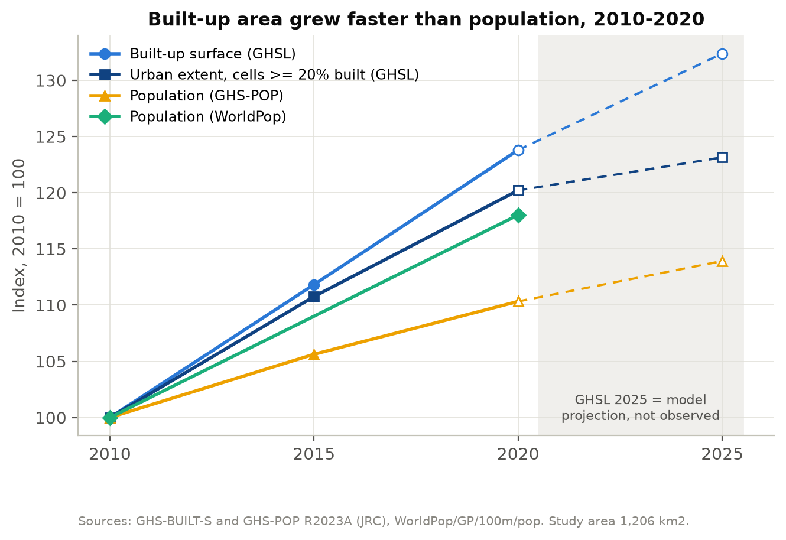

| | 2010 | 2015 | 2020 | 2025 (GHSL projection) |
|---|---|---|---|---|
| Built-up surface, km² | 72.48 | 81.05 | 89.73 | 95.95 |
| Urban extent, km² | 128.43 | 142.25 | 154.39 | 158.16 |
| Population, GHS-POP | 4,171,817 | 4,406,438 | 4,602,732 | 4,752,628 |

Built-up surface grew 23.8% and urban extent 20.2% (1.86% a year) over the
decade. The GHSL projection implies growth slowing to +6.9% in 2020–2025; our
own model projects faster growth (§5.9).

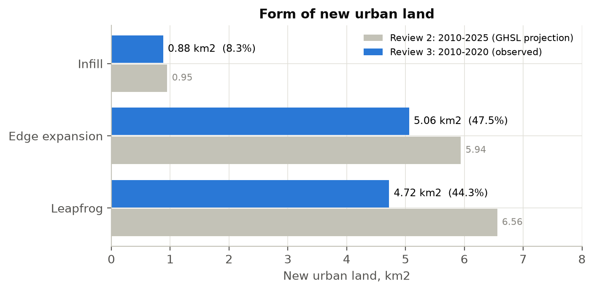

Of the 10.66 km² that became urban, 0.88 km² is infill (8.3%), 5.06 km² edge
expansion (47.5%) and **4.72 km² leapfrog (44.3%)** — development detached
from the existing city. Close to half of all new urban land is scattered, which
is the costliest form to supply with roads, water and drainage. Review 2's
48.8% was measured against the projection.

### 5.2 Population, and how fast land is consumed

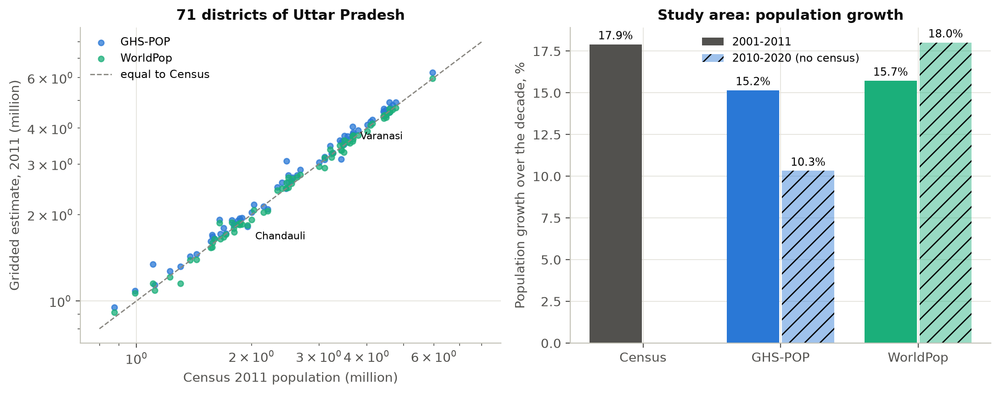

**District totals, Census 2011, 71 districts of Uttar Pradesh.** GHS-POP has a
median error of +3.4% (mean absolute 4.8%; 67 districts within 10%). WorldPop
has −0.4% (2.6%; 69 within 10%). Both follow the Census closely across
districts.

| Area | Census 2011 | GHS-POP | WorldPop |
|---|---|---|---|
| Varanasi district | 3,676,841 | +10.2% | +2.1% |
| Chandauli district | 1,952,756 | −7.0% | −6.1% |
| Varanasi Municipal Corporation (2011 town boundary) | 1,198,491 | **+62.8%** | +2.2% |

GHS-POP spreads population in proportion to built-up volume, so it places far
too many people in the dense old city.

**Growth.** Over the 1,011 towns and villages of the study area, the Census
records +17.9% from 2001 to 2011; GHS-POP gives +15.2% and WorldPop +15.7% for
the same places and years — both slightly low, both close. For 2010–2020 there
is no census (the 2021 Census has not been held): GHS-POP gives +10.3% and
WorldPop +18.0%. With built surface up 23.8%, built-up area grew **2.3× faster
than population with GHS-POP and 1.3× with WorldPop**. WorldPop's rate is in
line with the last census decade; GHS-POP's implies a sharp slowdown. We
therefore report the range. Land is being consumed faster than population
grows under either dataset; the magnitude is uncertain.

### 5.3 Night-time light

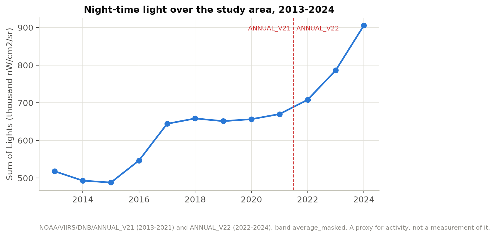

Sum of Lights over the study area rose from 518,008 (2013) to 905,354 (2024),
+74.8%, and 51.4% of urban cells show a statistically significant rise
(p ≤ 0.05). The largest yearly jumps are 2016→2017 (+17.8%) and 2023→2024
(+15.1%). The product change between 2021 and 2022 is marked on the chart; the
relative trend of §4.2 is insensitive to any such scene-wide step.

### 5.4 Growth typology and ghost growth

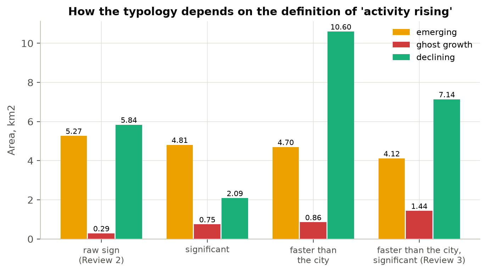

| Class, km² | Review 2 (2025, raw sign) | raw sign | significant | faster than city | faster and significant (Review 3) |
|---|---|---|---|---|---|
| emerging | 6.88 | 5.27 | 4.81 | 4.70 | **4.12** |
| ghost growth | 0.35 | 0.29 | 0.75 | 0.86 | **1.44** |
| declining | 5.70 | 5.84 | 2.09 | 10.60 | **7.14** |
| share of candidates filling up | 95% | 95% | 87% | 85% | **74%** |

Under the Review 3 rule the other classes are: established 138.03 km², healthy
growth 3.66 km², undeveloped 1,104.86 km².

The candidates — new development whose activity is in the bottom quartile for
its built-up intensity — are the same 5.56 km² under every rule; the rule only
decides how they split. Asking for evidence of catching up moves a quarter of
them to ghost growth. *Declining* swings between 2.1 and 10.6 km² with the rule,
so it is treated as indicative only.

Flagged cells group into **23 zones** where they occur at least twice as often
as across the city's developed land. The largest are zone 1 (25.288° N,
83.058° E; 4.76 km², 0.25 km² flagged), zone 2 (25.311° N, 83.103° E; 3.38 km²,
0.18 km²) and zone 3 (25.452° N, 83.098° E; 1.48 km², 0.09 km²). All are
peripheral.

### 5.5 Hold-out test of the typology

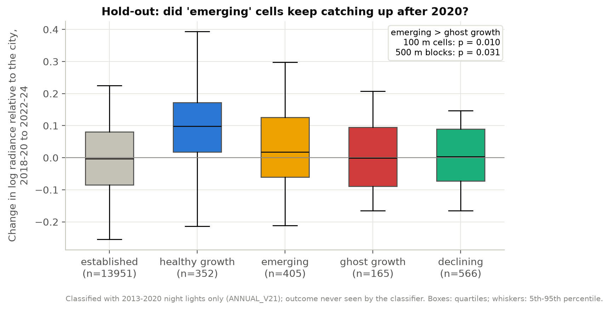

There are no ground labels for Varanasi, so the split was tested in time. The
classification was re-run using only the 2013–2020 night lights (all
`ANNUAL_V21`), then checked against what happened next, which the classifier
never saw: the change in brightness relative to the city from 2018–20 to
2022–24.

| Class (hold-out classification) | Area, km² | Median later change |
|---|---|---|
| healthy growth | 3.52 | +0.099 |
| emerging | 4.05 | +0.018 |
| ghost growth | 1.65 | −0.001 |
| established | 139.51 | −0.003 |
| declining | 5.66 | +0.004 |

Cells called *emerging* kept brightening relative to the city more than cells
called *ghost growth*: one-sided Mann-Whitney U test p = 0.010 over 405 and 165
cells, and p = 0.031 over 204 and 81 blocks of 500 m. The block test matters
because neighbouring 100 m cells share one VIIRS pixel. An emerging cell
out-brightened a ghost cell 56% of the time. The other rules: significant only
p = 0.002, raw sign p = 0.022, faster-than-city without significance p = 0.145.

91% of the hold-out *emerging* cells are also *emerging* in the full
classification. 71% of the hold-out *ghost* cells stay *ghost*; 24% became
*emerging* once 2021–24 was added — they began to fill up late.

**Meaning.** The split carries real information: places classified as filling
up went on filling up. The effect is modest, so the ghost map is a screening
map, not a verdict.

### 5.6 Do the flagged cells contain buildings?

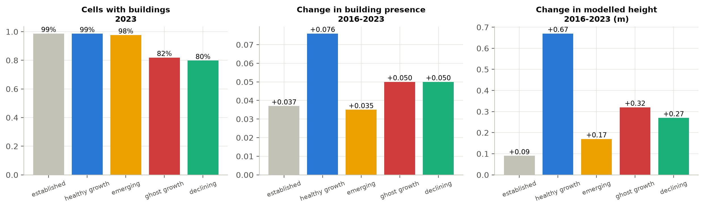

`GOOGLE/Research/open-buildings-temporal/v1` gives building presence and
modelled height for 2016 and 2023.

- **82%** of ghost cells contain buildings in 2023 (presence ≥ 0.05), against
  98–99% for the emerging, healthy-growth and established classes.
- **26 of 144 ghost cells (18%) contain no buildings at all** — likely GHSL
  false positives or land cleared but not yet built. They sit in 6 of the 23
  zones (zones 3, 9, 16, 18, 19 and 21; half of zone 20).
- Building presence in ghost cells rose by 0.05 between 2016 and 2023 and
  modelled height by 0.32 m — as much as in other classes. This fits "built but
  little used" better than "never built".

**Zone evidence cards.** `figures/zones/zone_01.png` to `zone_23.png`, one per
zone, show Sentinel-2 true colour for 2018-19 and 2024-25 with the flagged
cells outlined, Open Buildings presence for 2016 and 2023, the zone's night
light against the city, and its numbers. They are evidence for a human reader,
not a validation (§8).

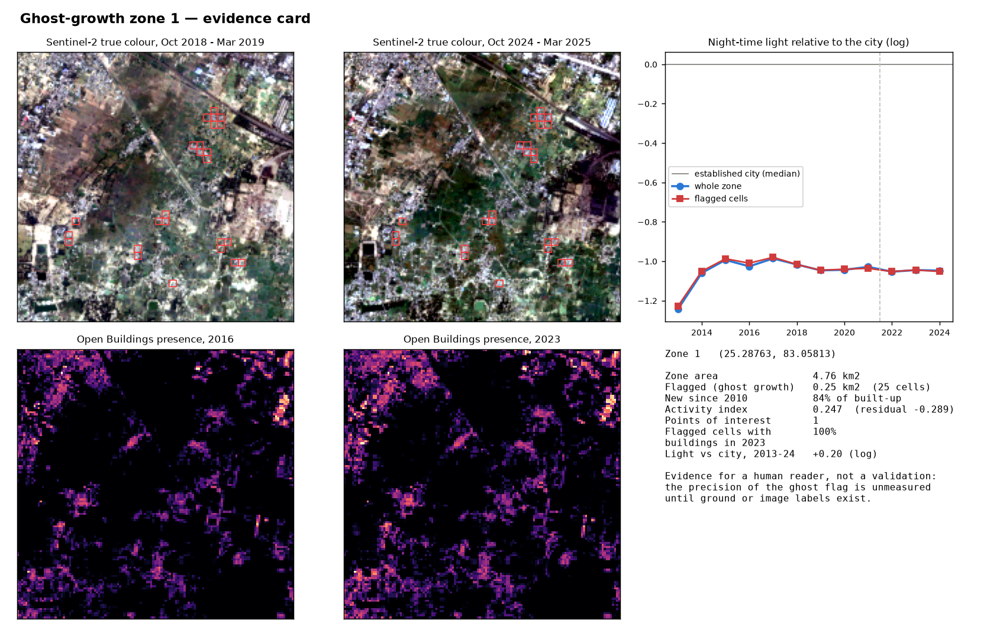

### 5.7 Surface heat, March–May

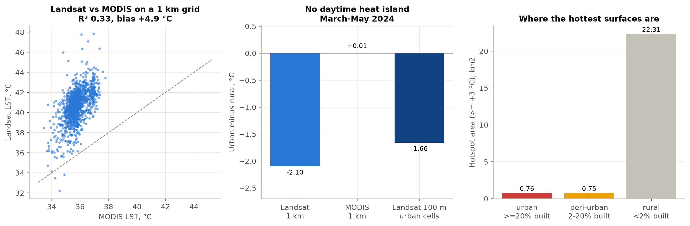

| | 2013 | 2024 |
|---|---|---|
| Rural reference | 46.34 °C | 41.42 °C |
| Mean intensity over urban cells | −1.35 °C | **−1.66 °C** |
| Hotspot area (≥ +3 °C) | 51.52 km² | 23.82 km² |

The same 2024 scene under the rural rules, before and after the fix:

| Rural reference rule | Reference | Mean over urban cells | Hotspots |
|---|---|---|---|
| Review 2: under 2% built | 41.18 °C | −1.43 °C | 28.16 km² |
| … minus water | 41.23 °C | −1.48 °C | 27.05 km² |
| … minus water and recently built land (Review 3) | 41.42 °C | −1.66 °C | 23.82 km² |

**Finding.** In the pre-monsoon daytime, Varanasi's built-up area is on
average cooler than the dry, bare farmland around it — a surface cool island.
Shastri et al. (2017) report the same seasonal pattern for many Indian cities.
The independent MODIS sensor shows no daytime heat island either (urban minus
rural +0.0 °C at 1 km; Landsat at 1 km: −2.1 °C). Of the 23.82 km² of
hotspots, 22.31 km² lie on rural land, 0.75 km² on peri-urban land and only
0.76 km² in urban cells.

Landsat and MODIS agree in rank (Spearman ρ 0.55, R² 0.33 at 1 km), but
Landsat reads 4.9 °C warmer on average (RMSE 5.1 °C). The two differ in
overpass sampling, algorithm and resolution, so we compare contrasts, not
absolute temperatures.

Between 2013 and 2024 urban cells became 0.31 °C cooler relative to rural land.
New development cooled most (healthy growth −1.30 °C, ghost growth −1.14 °C).
The 2013 composite comes from only 5 dates, so this change is indicative.

**Consequence.** Review 2's "+1.10 °C mean urban heat-island intensity" was the
mean over the warmer-than-rural cells only. The heat-vulnerability layer, which
weights heat by the number of residents, remains the useful planning output.

### 5.8 Green cover

Comparing NDVI for October–March 2018-19 and 2024-25: 6.37 km² of green cover
was lost and 51.31 km² gained, and green cover went from 71.0% to 77.9% of the
study area — mostly the cropping calendar. Green cover lost **to built-up**,
using Dynamic World gain over the same years, is **0.67 km²** (10.5% of all
loss). Review 2 reported 0.05 km² using mismatched periods. Dynamic World shows
28.05 km² of built-up gain in 2018–2024.

### 5.9 Growth model and projections

| Model | AUC, training period | AUC, held-out period | Figure of Merit | × random |
|---|---|---|---|---|
| Logistic regression | 0.990 | 0.910 | 0.069 | 12.5× |
| Logistic regression, no roads | 0.990 | 0.910 | 0.069 | 12.5× |
| **Random forest** | 0.993 (out-of-bag) | 0.834 | **0.103** | **18.7×** |
| Random allocation | — | 0.500 | 0.0055 | 1× |

Training period 2010–2015: 113,082 eligible (non-urban) cells, of which 1,382
became urban (1.22%). Held-out period 2015–2020: 1,214 cells became urban.

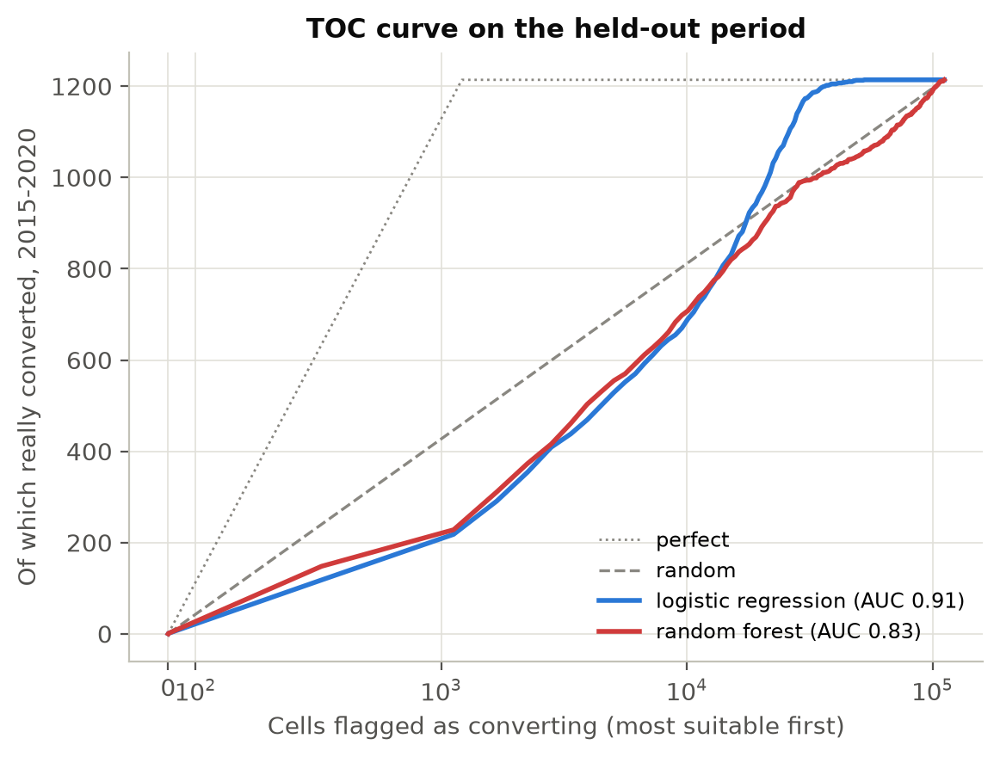 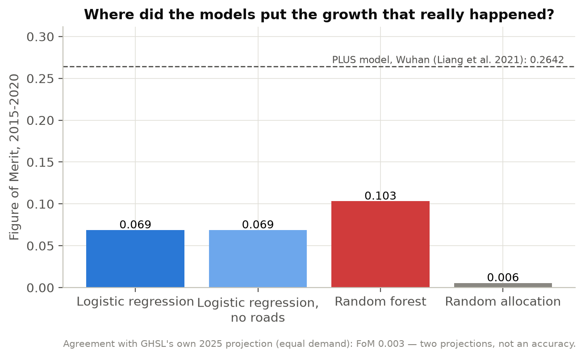

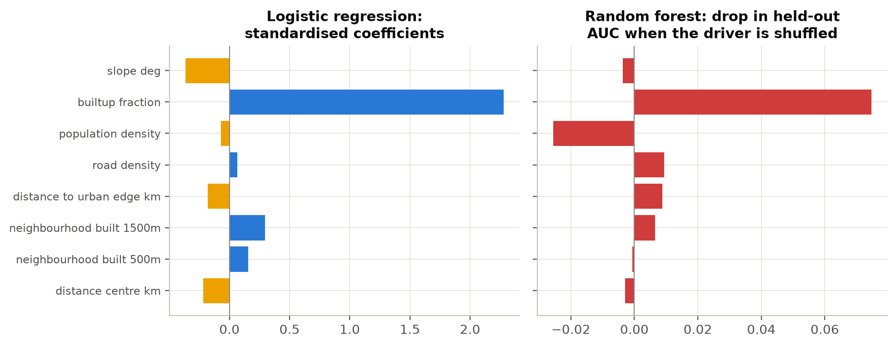

**Reading the scores.**

- The random forest puts more of the real growth in the right place — 227
  correct cells out of 1,214, against 156 — so its Figure of Merit is higher.
  It ranks the bulk of the cells less well (AUC 0.83 against 0.91). The TOC
  curve shows why: the forest is sharper at the top of its ranking, which is
  the part the allocation step uses.
- The training AUC of 0.99 overstates skill. The held-out AUC is the honest
  figure; Review 2 quoted only the training value.
- The existing built-up fraction dominates (logistic coefficient 2.28;
  random-forest importance 0.075), followed by neighbourhood density and
  distance to the urban edge.
- Removing roads changes nothing (Figure of Merit 0.0687 both ways), so the
  present-day road snapshot is not leaking into the result.
- Slope: the median is 1.95° on a flat plain, which is mostly noise in the
  SRTM elevation model. Its negative logistic coefficient (−0.37) probably
  reflects river banks, and the random forest gives it no importance.
- Population density *lowers* the forest's held-out AUC when kept
  (importance −0.026), so it is a candidate to drop.
- For scale: PLUS in Wuhan reached a Figure of Merit of 0.264 (Liang et al.
  2021). It is a different city, set of land classes and period — a reference
  level, not a like-for-like comparison.

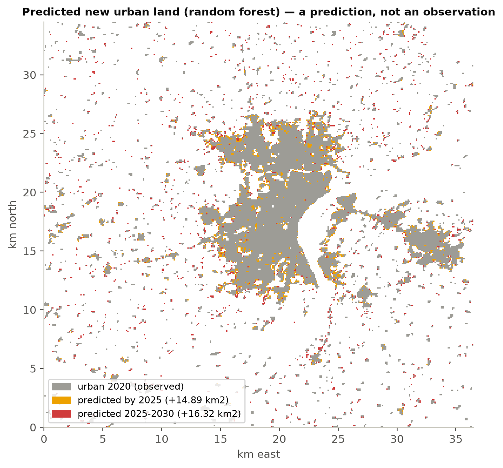

**Projection (a prediction, not an observation).** Continuing 2010–2020's
growth of urban extent (1.86% a year) and placing it with the random forest:
**+14.89 km² by 2025 and +31.21 km² by 2030**, measured from 2020. GHSL's own
projection adds only 3.77 km² by 2025; given the same amount of growth, our map
and GHSL's agree at a Figure of Merit of 0.003. The two projections disagree on
both amount and location — neither 2025 map is an observation. The map also
shows the second step scattering some growth around villages; the
neighbourhood weight is a tuning item for Review 4.

### 5.10 How much is built? Six datasets

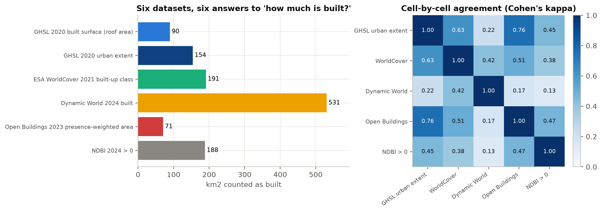

| Dataset | Built, km² | Agreement with GHSL urban extent (Cohen's κ) |
|---|---|---|
| GHSL 2020 built surface (roof area) | 89.7 | — |
| GHSL 2020 urban extent (cells ≥ 20% built) | 154.4 | 1 |
| ESA WorldCover 2021 built-up class | 191.3 | 0.63 |
| Dynamic World 2024, most frequent label | 531.0 | 0.22 |
| Open Buildings 2023, presence-weighted | 70.7 | **0.76** |
| NDBI 2024 above zero | 188.3 | 0.45 |

The datasets measure different things — roof area, a land-cover class, a
spectral index — so they are not expected to match. Cohen's kappa measures
agreement beyond chance (1 = identical maps, 0 = no better than chance). Open
Buildings agrees best with GHSL. WorldCover counts 132 km² as built that GHSL
does not: village clusters, roads and yards. Dynamic World's built class
spreads into 479 km² of villages and dry-season fields, so here it is used only
for water and for the direction of change, never as a built-up map.

### 5.11 Does night-time light measure economic activity here?

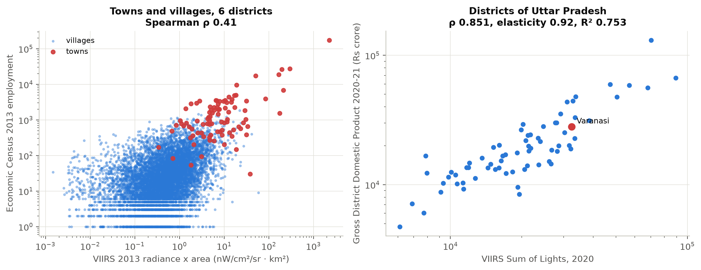

**Towns and villages, 2013** (six districts: Varanasi, Chandauli, Jaunpur,
Ghazipur, Mirzapur, Sant Ravidas Nagar; 10,143 places including 91 towns):

| Pair | Spearman ρ |
|---|---|
| Night-time light vs Economic Census employment | 0.41 |
| Night-time light vs population | 0.47 |
| Population vs employment | 0.69 |
| Light per person vs jobs per person | 0.12 |

**Districts of Uttar Pradesh** (71 districts at 2011 boundaries):

| Pair | Spearman ρ | Elasticity (log-log slope) | R² |
|---|---|---|---|
| Sum of Lights 2020 vs GDDP 2020-21 (revised) | 0.85 | 0.92 ± 0.06 | 0.75 |
| Sum of Lights 2021 vs GDDP 2021-22 (tentative) | 0.86 | 0.96 ± 0.06 | 0.77 |
| Per person, 2020-21 | 0.58 | 0.76 | 0.49 |
| Sum of Lights 2013 vs Economic Census employment | 0.70 | 0.68 | 0.59 |

Varanasi's GDDP in 2020-21 (₹28,006 crore) is 95% of what its lights predict.

**Meaning.** Night-time light is a sound proxy for economic activity at
district scale — the scale of most published evidence (Henderson et al. 2012).
At village scale it mostly measures settlement size, and population predicts
jobs better than light does. This is why the ghost-growth screen combines
light with points of interest and population, reports at 500 m, and only
claims zones of at least 0.25 km², not single cells.

---

## 6. Corrections log

"Before" is what Review 2 showed; "after" is this report.

| # | What was wrong | Fix | Before | After |
|---|---|---|---|---|
| D1 | GHSL 2025, a model projection, was the "current" epoch everywhere (`config/varanasi.yaml`, `pipeline.py`) | observed epochs only; `check_epochs()` refuses projections; 2 tests | +23.47 km² built, 1.40%/yr, 13.45 km² new urban, 48.8% leapfrog, 0.35 km² ghost | +17.25 km², 1.86%/yr, 10.66 km², 44.3% leapfrog, 1.44 km² ghost |
| D2 | Water was not excluded from the heat-island rural reference, though code comments and the dashboard said it was | Dynamic World water and recently-built land removed | reference 41.12 °C, hotspots 26.57 km² | 41.42 °C, 23.82 km² |
| D3 | "Mean urban intensity" was the mean over all warmer-than-rural cells | mean over urban cells; old figure kept as `mean_positive_intensity_c` | +1.10 °C | **−1.66 °C** |
| D4 | *Emerging* vs *ghost* used the raw sign of the light trend, with no significance test, while the whole city brightened | relative-to-city trend with p ≤ 0.10; four rules reported; hold-out test | 95% filling up | 74%, hold-out p = 0.010 |
| D5 | Allocation dropped `demand mod 8` cells | remainder placed in the last iteration; test | 1,208 of 1,214 placed | 1,214 of 1,214 |
| D6 | Only the training (in-sample) AUC was reported | held-out AUC added | 0.9901 | 0.910 (LR), 0.834 (RF) |
| D7 | Slope was listed as a driver in the documents but never computed | slope from `USGS/SRTMGL1_003` | — | coefficient −0.37; no RF importance |
| D8 | Present-day roads used to explain 2010–2015 growth | model refitted without roads | — | no change (FoM 0.0687 both) |
| D9 | Only a +10-year projection; the approved design promises +5 and +10 | two five-year steps | +31.21 km² by 2030 | +14.89 km² by 2025, +31.21 km² by 2030 |
| D10 | Landsat mask used QA bits 3–4 only; no depth check; the date record counted Landsat 8 only | bits 1–4; ≥ 4 dates; Landsat 8 and 9 counted | "10 scenes on 5 days" | 22 scenes on 11 days |
| D11 | Green loss 2018–2024 intersected with built-up gain 2010–2025 | Dynamic World gain over the same years | 0.05 km² (0.8%) | 0.67 km² (10.5%) |
| D12 | Dynamic World, Open Buildings, NDBI and LST 2013 were downloaded but unused; SRTM, MODIS and WorldCover were configured but unused | all used (§5.6, §5.7, §5.9, §5.10) | — | — |
| D13 | Dashboard headline showed "Built-up surface 2025" unlabelled; no growth-model output | observed values labelled; projection captioned; model layers and a Validation tab added | — | — |
| D14 | Documents contradicted the code: LST "emissivity correction" (none is applied — USGS already does it), water exclusion, slope, 2025 as observed | `gee.py` docstring fixed; correction notices on the Review 2 documents; method documents updated | — | — |
| D15 | "Built-up grew 2.3× faster than population" rested on GHS-POP alone. Our own planning audit also mis-stated WorldPop's error (−12.0% for Varanasi district) by summing its per-pixel counts on the wrong grid | both datasets checked against the Census on their own grids | 2.3× | 1.3×–2.3×; WorldPop +2.1% for Varanasi district |

---

## 7. Review 2 panel comments and action taken

Project Guidelines §2: review comments must be recorded and the action taken
presented at the following review (1 mark at Review 3). **To be completed by the
team before 15 September from the Review 2 panel's comments.**

| # | Panel comment (as recorded at Review 2) | Action taken | Where to see it |
|---|---|---|---|
| 1 | | | |
| 2 | | | |
| 3 | | | |
| 4 | | | |

---

## 8. Limitations

- **No ground truth for the ghost flag.** How often a flagged zone is truly
  vacant is unmeasured. The hold-out test (§5.5) and the Open Buildings check
  (§5.6) are indirect evidence, and the zone cards are for a human reader.
- **Scale of night-time light.** VIIRS pixels are about 463 m across; light is
  a weak proxy at village scale (§5.11).
- **Population.** GHS-POP over-counts the city core by 63% at the 2011 town
  boundary; the activity index still uses it, with a weight of 0.20.
- **Heat.** Daytime only; the 2013 composite has 5 dates; Landsat and MODIS
  differ by 4.9 °C in absolute terms.
- **Dynamic World's built class** is unreliable in this landscape (§5.10).
- **Projection.** Demand assumes the 2010–2020 rate continues; roads and
  population are held at 2020 values; the second step scatters some growth.
- **OpenStreetMap** points of interest are thin on the periphery and are a
  present-day snapshot.
- The **2013 Economic Census** is the latest one available to us at town and
  village level. District comparisons use 2011 boundaries: Shamli, Hapur,
  Sambhal and Amethi, created after the Census, are added back to the
  districts they came from.

---

## 9. Plan for Review 4

| Item | Detail |
|---|---|
| City search | Nominatim geocoding → circle → GHSL from Earth Engine (`JRC/GHSL/P2023A/GHS_BUILT_S`, checked against the bulk tile) → automatic UTM zone |
| Labels for flagged zones | image interpretation of a sample of flagged and unflagged cells on historical high-resolution imagery, to measure the precision of the ghost flag |
| Activity index | a WorldPop-based variant; drop the population driver from the growth model if the held-out result confirms it |
| Planning data | ward-level reporting (Census ward tables and ward boundaries, after a licence check); VDA Master Plan 2031 overlay; Bhuvan NUIS/AMRUT land use; UP RERA cross-check |
| Growth model | tune the neighbourhood weight; report a range of demand scenarios |
| Publication | a paper submission for Review 4 item 9, built on §5.5 and §5.11 |
| Report | Chapters 1–4 near-final; individual reports |

---

## 10. Contributions and AI acknowledgement

Who owns each work package is recorded in
[`../CONTRIBUTIONS.md`](../CONTRIBUTIONS.md). Each owner re-runs, explains and
presents their own part.

**AI acknowledgement (Project Guidelines §2).** An AI assistant (Claude, by
Anthropic) was used for code, analysis scripts and documentation in this
project, including the work reported here. Every result comes from scripts in
this repository and can be reproduced with `run_review3.bat`; the team is
responsible for understanding, checking and presenting each part.

---

## 11. References

**Papers**

- Asher, S., Lunt, T., Matsuura, R. and Novosad, P. (2021). Development research
  at high geographic resolution: an analysis of night-lights, firms, and poverty
  in India using the SHRUG open data platform. *The World Bank Economic Review*
  35(4).
- Brown, C. F. et al. (2022). Dynamic World, near real-time global 10 m land use
  land cover mapping. *Scientific Data* 9, 251.
- Elvidge, C. D., Zhizhin, M., Ghosh, T., Hsu, F.-C. and Taneja, J. (2021).
  Annual time series of global VIIRS nighttime lights derived from monthly
  averages: 2012 to 2019. *Remote Sensing* 13(5), 922.
- Henderson, J. V., Storeygard, A. and Weil, D. N. (2012). Measuring economic
  growth from outer space. *American Economic Review* 102(2), 994–1028.
- Liang, X. et al. (2021). Understanding the drivers of sustainable land
  expansion using a patch-generating land use simulation (PLUS) model: a case
  study in Wuhan, China. *Computers, Environment and Urban Systems* 85, 101569.
- Pontius, R. G. Jr. et al. (2008). Comparing the input, output, and validation
  maps for several models of land change. *The Annals of Regional Science*
  42(1), 11–37.
- Pontius, R. G. Jr. and Si, K. (2014). The total operating characteristic to
  measure diagnostic ability for multiple thresholds. *International Journal
  of Geographical Information Science* 28(3), 570–583.
- Shastri, H., Barik, B., Ghosh, S., Venkataraman, C. and Sadavarte, P. (2017).
  Flip flop of day-night and summer-winter surface urban heat island intensity
  in India. *Scientific Reports* 7, 40178.

The twenty papers reviewed at Review 2 are summarised in
[`PAPER_SUMMARIES.md`](PAPER_SUMMARIES.md).

**Datasets** — as listed in §3, with official identifiers. SHRUG data are used
under CC BY-NC-SA 4.0 and cited as Asher et al. (2021).
