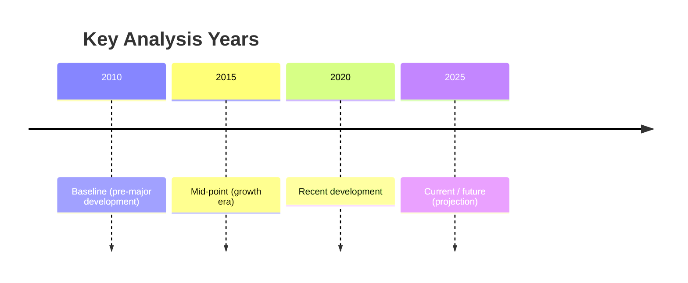

# Executive Summary  
A robust satellite-data pipeline for Varanasi’s urban growth and economic monitoring should leverage both global and India-specific datasets.  Key sources include **nighttime lights** (VIIRS DNB 2012–2025 and DMSP-OLS 1992–2014) as proxies for economic activity; **optical imagery** (Sentinel-2 and Landsat 5/7/8/9 surface reflectance) for land-cover and vegetation analysis; **thermal products** (MODIS LST, Landsat thermal) for urban heat; **DEM/topography** (SRTM 30m, ALOS AW3D30) for terrain; **SAR** (Sentinel-1 GRD) for building/water detection. We also incorporate **Harmonized Landsat/Sentinel (HLS)** composites (30 m, 2–3 day) for consistent 30 m time series.  Ancillary data include **OpenStreetMap** (roads, buildings), administrative boundaries and census (socioeconomic) data. Each dataset’s Earth Engine asset or download link, resolution, date range, and processing notes are detailed below.  Preprocessing involves cloud masking (QA60 band for S2, CFmask for Landsat), annual or multi-year median compositing, reprojection to common grid, and computation of indices (NDVI, NDWI, NDBI) and built‐up masks.  A mermaid timeline (2010, 2015, 2020, 2025) illustrates suggested analysis snapshots. Code snippets show how to load collections, compute NDVI or built-up, and extract VIIRS time series for Varanasi. Limitations (e.g. resolution gaps, saturation of lights, license terms) and a recommended data-processing table are also provided.  

## Satellite Imagery Datasets  

| **Dataset**                         | **Provider / Platform**               | **Spatial / Temporal**         | **Years**        | **Use**                                 | **Link / Asset ID**                    |
|-------------------------------------|---------------------------------------|-------------------------------|------------------|-----------------------------------------|----------------------------------------|
| **NOAA/VIIRS/DNB/ANNUAL_V22**       | NOAA / CSU Mines (Google Earth Engine) | 0.46 km (463.83 m) annual     | 2012–2025        | Nighttime radiance (economic proxy) | [GEE Catalog](https://developers.google.com/earth-engine/datasets/catalog/NOAA_VIIRS_DNB_ANNUAL_V22) (id: `NOAA/VIIRS/DNB/ANNUAL_V22`) |
| **NOAA/DMSP-OLS/NIGHTTIME_LIGHTS**  | NOAA / CSU Mines (GEE)                 | 0.93 km (927.67 m) annual     | 1992–2014        | Historic nighttime lights | [GEE](https://developers.google.com/earth-engine/datasets/catalog/NOAA_DMSP-OLS_NIGHTTIME_LIGHTS) (id: `NOAA/DMSP-OLS/NIGHTTIME_LIGHTS`) |
| **COPERNICUS/S2_HARMONIZED**        | ESA / GEE                             | 10–60 m Multispectral (TOA)   | 2015–present     | Sentinel-2 TOA (DN harmonized) | [GEE](https://developers.google.com/earth-engine/datasets/catalog/COPERNICUS_S2_HARMONIZED) |
| **COPERNICUS/S2_SR_HARMONIZED**     | ESA / GEE                             | 10–20 m Surface Reflectance  | 2017–present     | Sentinel-2 L2A SR (atmospheric corr)    | [GEE](https://developers.google.com/earth-engine/datasets/catalog/COPERNICUS_S2_SR_HARMONIZED) |
| **LANDSAT/LC09/C02/T1_L2**          | USGS / GEE                            | 30 m (OLI-2/TIRS-2)           | 2021–present     | Landsat 9, surface reflectance & LST    | [GEE](https://developers.google.com/earth-engine/datasets/catalog/LANDSAT_LC09_C02_T1_L2) (id: `LANDSAT/LC09/C02/T1_L2`) |
| **LANDSAT/LC08/C02/T1_L2**          | USGS / GEE                            | 30 m (OLI/TIRS)              | 2013–present     | Landsat 8, surface reflectance & LST    | [GEE](https://developers.google.com/earth-engine/datasets/catalog/LANDSAT_LC08_C02_T1_L2) (id: `LANDSAT/LC08/C02/T1_L2`) |
| **LANDSAT/LE07/C02/T1_L2**          | USGS / GEE                            | 30 m (ETM+)                  | 1999–2024        | Landsat 7, surface reflectance & LST    | [GEE](https://developers.google.com/earth-engine/datasets/catalog/LANDSAT_LE07_C02_T1_L2) (id: `LANDSAT/LE07/C02/T1_L2`) |
| **LANDSAT/LT05/C02/T1_L2**          | USGS / GEE                            | 30 m (TM)                    | 1984–2012        | Landsat 5, surface reflectance & LST    | [GEE](https://developers.google.com/earth-engine/datasets/catalog/LANDSAT_LT05_C02_T1_L2) (id: `LANDSAT/LT05/C02/T1_L2`) |
| **NASA/HLS/HLSL30/v002**           | NASA LP DAAC (GEE)                   | 30 m NBAR (Landsat)         | 2013–2026        | Harmonized Landsat+S2 (Landsat part) | [GEE](https://developers.google.com/earth-engine/datasets/catalog/NASA_HLS_HLSL30_v002) |
| **NASA/HLS/HLSS30/v002**           | NASA LP DAAC (GEE)                   | 30 m NBAR (Sentinel-2)      | 2015–present     | Harmonized Landsat+S2 (S2 part)          | [GEE](https://developers.google.com/earth-engine/datasets/catalog/NASA_HLS_HLSS30_v002) |
| **MODIS/061/MOD11A1**              | NASA LP DAAC (GEE)                   | 1 km LST daily Terra         | 2000–2025        | Daily land surface temperature (day/night) | [GEE](https://developers.google.com/earth-engine/datasets/catalog/MODIS_061_MOD11A1) |
| **USGS/SRTMGL1_003**              | NASA/USGS (GEE)                      | 30 m DEM (void-filled)       | Feb 2000 (SRTM)  | Global elevation (DEM)   | [GEE](https://developers.google.com/earth-engine/datasets/catalog/USGS_SRTMGL1_003) |
| **JAXA/ALOS/AW3D30/V4_1**         | JAXA (GEE)                           | 30 m DSM (world)            | 2006–2011 (ACq)  | Global ALOS DSM (digital surface) | [GEE](https://developers.google.com/earth-engine/datasets/catalog/JAXA_ALOS_AW3D30_V4_1) |
| **COPERNICUS/S1_GRD**             | ESA (GEE)                            | 10–40 m SAR (C-band GRD)    | 2014–present     | Sentinel-1 SAR (VV/VH) for built/water  | [GEE](https://developers.google.com/earth-engine/datasets/catalog/COPERNICUS_S1_GRD) |
| **OpenStreetMap (geofabrik)**     | OpenStreetMap (Geofabrik extract)     | Vector (roads, buildings)   | Continually      | Road/building footprints, POIs         | [Download India OSM](https://download.geofabrik.de/asia/india.html) (latest PBF/shapefile) |
| **Bhuvan (ISRO)**                | ISRO Bhuvan portal                   | Various (India landuse, etc) | Various         | India-specific urban/landuse maps      | [Bhuvan Geoportal](https://bhuvan.nrsc.gov.in) |

Each dataset above is prioritized for urban/heat/greenness analysis: **night-lights** track electric infrastructure (economy/population); **optical multispectral** (Sentinel-2, Landsat, HLS) enable built-up mapping, vegetation indices (NDVI, NDWI, NDBI), and water/green cover changes; **thermal** (MODIS, Landsat TIR) measure surface temperature and urban heat island; **DEM/SAR** provide terrain and all-weather surface characterization. High-cadence composites (HLS, Sentinel-2) allow reducing cloud gaps. All GEE asset IDs are given; direct links point to Earth Engine or source portals.

## Temporal Ranges & Processing  
We suggest analysis at benchmark years (e.g. 2010, 2015, 2020, 2025) – see timeline below – using multi-year composites around those dates to minimize cloud/noise. For optical data (Sentinel-2, Landsat), use **surface reflectance collections** (e.g. `COPERNICUS/S2_SR_HARMONIZED`, `LANDSAT/LC08/C02/T1_L2`) and apply cloud masks (S2 QA60 band, Landsat CFmask/Fmask) before compositing (e.g. annual median). Compute indices per image or composite: **NDVI** (NIR vs Red), **NDWI** (Green vs NIR), **NDBI** or other built-up indices (e.g. `(SWIR-NIR)/(SWIR+NIR)`) for impervious extraction. For nighttime lights, use annual VIIRS composites for recent years, DMSP for pre-2012; normalize or calibrate between them if blending. For SAR, filter to one polarization (e.g. VV) and optionally speckle-filter before mosaicking annual stacks. Reproject all to a common projection (e.g. UTM zone of Varanasi) for multi-dataset comparison.  Typical steps: masking, merging multi-scene composites, resampling to 30 m or coarser for heatmaps, and calculating per-pixel or zonal stats.

```javascript
// JavaScript Earth Engine snippet example:
var region = ee.Geometry.Rectangle([82.9, 25.2, 83.2, 25.4]);  // Varanasi bbox
// VIIRS (annual average radiance for 2020)
var viirs2020 = ee.ImageCollection('NOAA/VIIRS/DNB/ANNUAL_V22')
                 .filterDate('2020-01-01','2020-12-31')
                 .select('average').median();
Map.centerObject(region, 12);
Map.addLayer(viirs2020.clip(region), {min:0,max:50}, 'VIIRS 2020');
// Sentinel-2 (median 2020, NDVI)
var s2 = ee.ImageCollection('COPERNICUS/S2_SR_HARMONIZED')
           .filterDate('2020-01-01','2020-12-31')
           .filterBounds(region)
           .map(function(img) { 
               // simple cloud mask: bitwise QA60 (cloud mask band)
               var cloud = img.select('QA60').bitwiseAnd(1<<10).or(img.select('QA60').bitwiseAnd(1<<11));
               return img.updateMask(cloud.not()); 
           });
var s2m = s2.median();
var ndvi = s2m.normalizedDifference(['B8','B4']).rename('NDVI');
Map.addLayer(ndvi.clip(region), {min:0, max:1, palette:['white','green']}, 'S2 NDVI 2020');
// Landsat 8 (2020 median, built-up mask via NDBI threshold)
var ls8 = ee.ImageCollection('LANDSAT/LC08/C02/T1_L2')
           .filterDate('2020-01-01','2020-12-31')
           .filterBounds(region)
           .map(function(img) {
             return img.updateMask(img.select('QA_PIXEL').bitwiseAnd(8).eq(0));  // mask clouds
           })
           .median();
var ndbi = ls8.normalizedDifference(['SR_B6','SR_B5']).rename('NDBI');
var built = ndbi.gt(0).selfMask();
Map.addLayer(built.clip(region), {palette:['orange']}, 'L8 Built-up');
// VIIRS time series (2015-2025 mean radiance)
var viirsTS = ee.ImageCollection('NOAA/VIIRS/DNB/ANNUAL_V22')
                .filter(ee.Filter.bounds(region))
                .select('average');
print(ui.Chart.image.series(viirsTS, region, ee.Reducer.mean(), 1000)
      .setOptions({title: 'VIIRS Night Lights (mean radiance, Varanasi)'}));
```

## Auxiliary Data & Links  
- **OpenStreetMap** (roads, buildings, urban features): Download India extracts (PBF or shapefile) from Geofabrik, or query via Overpass API for Varanasi.  Example geofabrik link: [India OSM (latest)](https://download.geofabrik.de/asia/india.html).  
- **Administrative boundaries**: Varanasi district/municipality shapefiles can be obtained from India’s Survey of India or state GIS portals. The Census of India provides district maps and village-level boundaries (see *District Census Handbook, Varanasi*).  
- **Socioeconomic data**: 2011 Census (Varanasi district handbook) for population & demographics; state Government of Uttar Pradesh or municipal data for growth rates and projections; economic indicators from sources like CEIC or MoSPI. (Varanasi city GDP data may require national reports or urban observatories.)  
- **Elevation**: SRTM and ALOS (above) cover Varanasi topography.  
- **Land use / land cover**: ISRO Bhuvan geoportal hosts thematic maps (e.g. LULC from AWiFS/LISS III) for India by year. Other global LULC products (e.g. Copernicus Global Land Cover 100m) can supplement.  

## Data Processing & Limitations  
**Cloud Masking & Compositing:** Use Sentinel-2 QA bands and Landsat CFMask to remove clouds/shadows. Build annual or seasonal composites (e.g., median composite per year) to fill gaps. HLS products already include cloud masking.  **Indices:** Compute NDVI, NDWI, NDBI (using near-IR/green/red/SWIR bands) on preprocessed composites to extract vegetation, water, and built-up areas. In Earth Engine: `image.normalizedDifference(['B8','B4'])` for NDVI (Sentinel-2) or `['SR_B5','SR_B4']` for Landsat. **Night Lights:** VIIRS values (nanoWatts/cm²/sr) are already calibrated annual composites; DMSP-OLS are DN (0–63) stable lights. If combining, one may apply an intercalibration (e.g. linear offset) to align scales. **Projection/Aggregation:** For city-scale analysis, data can be aggregated (e.g. compute mean VIIRS over the municipal area) or downscaled. All imagery is globally georeferenced (WGS84); resample to a common CRS (e.g. UTM zone 44N for Varanasi).  

**Limitations:**  
- **Cloud cover:** Monsoon (June–Sept) in Varanasi causes frequent clouds; use multi-temporal composites or alternate datasets (e.g. use HLS to get more clear days).  
- **Resolution mismatch:** Nightlights (~500–1000 m) are coarse relative to 10–30 m optical data; built-up boundaries from lights will be approximate.  
- **Saturation:** DMSP-OLS DN values saturate in bright urban cores (cap at 63). VIIRS has better dynamic range but still may underestimate very bright areas.  
- **Spectral differences:** Sentinel-2 vs Landsat bandpasses differ slightly; indices should be interpreted carefully. Harmonized collections (HLS, S2_HARMONIZED) mitigate this.  
- **License:** All above data are free/public domain (Landsat, Sentinel, MODIS, VIIRS, DMSP, OSM). Copernicus data (Sentinel) are open; Bhuvan may have terms (mostly free for research).  
- **Temporal aggregation:** For trend analysis, use multi-year averages (e.g. 3-year running mean) to reduce anomalies. Avoid comparing single images across seasons.



## Recommended Data Pipeline  

| **Dataset**               | **Purpose**                     | **Freq.**    | **Notes**                                                    |
|---------------------------|---------------------------------|--------------|--------------------------------------------------------------|
| VIIRS Nightlights         | Economic activity proxy         | Annual       | Use median radiance; calibrate DMSP overlap.     |
| DMSP-OLS Nightlights      | Historical nighttime lights     | Annual       | Use up to 2013 for pre-VIIRS trends.            |
| Landsat (L5/7/8/9 L2)     | Land cover/vegetation/heat      | 16-day       | Cloud mask then annual composite; compute NDVI/NDBI/LST.     |
| Sentinel-2 (SR)          | High-res NDVI/built-up          | ~5-day       | Cloud mask via QA60; annual median composite; NDVI, NDBI.    |
| HLS (L30 & S30)          | Frequent 30m composites         | ~3-day       | Already atmospherically corrected; smooths cloud gaps.|
| MODIS LST (MOD11/MYD11)   | Urban heat (1 km)               | Daily/8-day  | Use 8-day or monthly means to reduce noise.                 |
| SRTM/ALOS DEM             | Elevation/topography            | Static       | Reproject to analysis grid; compute slope if needed.         |
| Sentinel-1 (GRD)          | Floods, surface structure       | ~6-day       | Filter VV/VH, mosaic for seasons; good all-weather mapping.  |
| OpenStreetMap (vector)    | Roads, building footprints      | Static/latest| Clip to area (e.g. Geofabrik India), use for land-use/settlement context. |
| Census / admin data       | Boundaries, population, GDP     | Decennial/   | Integrate as masks/zones; e.g. census blocks or city wards.  |
| **Output Layers**         | **Use**                         | **Res.**     | **Processing**                                              |
| Composite NDVI maps       | Vegetation cover / change       | 30m/10m      | Use to mask vegetation vs built areas.                       |
| Built-up masks            | Impervious surface             | 30m/10m      | Threshold NDBI or use SWIR/NIR indices.                      |
| Urban heat maps           | Surface temperature anomalies  | 30m/1km      | Use Landsat TIR and MODIS LST (resampled).                   |
| Nightlight intensity      | Economic growth time series    | 500m/1km     | Plot VIIRS by year for city polygon.                         |

**Code references:** The above Earth Engine snippets show loading VIIRS, Sentinel-2, and Landsat collections, performing cloud masking and index calculations. Modify the date ranges and geometry for each analysis year. For Python, use `ee.ImageCollection('NOAA/VIIRS/DNB/ANNUAL_V22')`, `ee.ImageCollection('COPERNICUS/S2_SR_HARMONIZED')`, etc., similarly. 

**Sources:** Dataset details from Earth Engine Data Catalog pages. OpenStreetMap data (Geofabrik) at. LandSat and Sentinel info from USGS/ESA and catalog. Census and local data from Government of India portals (Census 2011, UP government). All data cited above are publicly available or open-access for research.